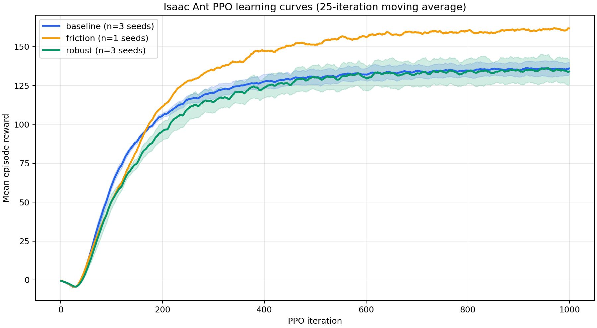
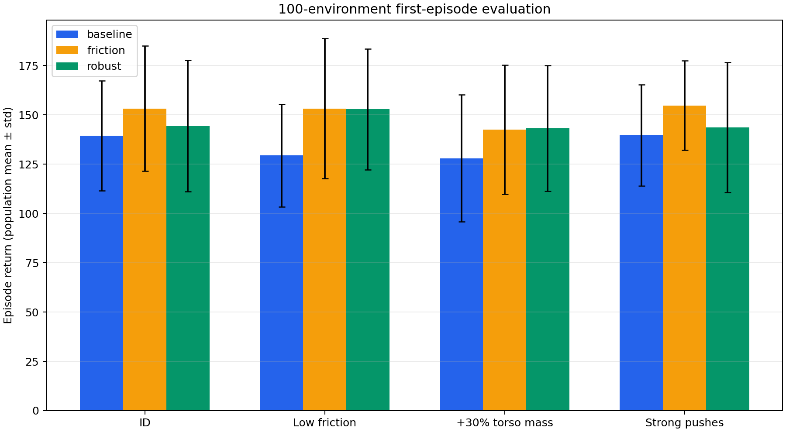

# Robust Ant PPO — Robotics Simulation Week 03

Isaac Lab의 `Isaac-Ant-v0`에서 **같은 PPO와 sample budget을 유지한 채 domain
randomization이 처음 보는 물리 조건의 일반화를 개선하는가**를 검증한 재현 가능한
프로젝트입니다.

> 공개 저장소 URL: https://github.com/williewonker777/robotics-simulation-week03-ant-robust

## 결론

가설은 **지지되었지만 효과의 크기는 조건별로 달랐습니다.** Baseline과 Robust를 각각
3개 학습 seed로 반복하고, 각 checkpoint를 100개 vectorized environment에서 한 episode씩
평가했습니다. 3-seed pooled 결과에서 Robust는 Baseline 대비 ID `+3.6%`, 저마찰
`+18.1%`, 추가 하중 `+12.0%`, 강한 외란 `+2.9%`의 평균 return 개선을 보였습니다.
세 공개 OOD 조건의 단순 평균은 `+10.8%`입니다.

| Variant | Scenario | Train seeds | Episodes | Return mean ± population std | Mean length |
|---|---:|---:|---:|---:|---:|
| Baseline | ID | 3 | 300 | 139.38 ± 27.81 | 928.3 |
| Baseline | Low friction | 3 | 300 | 129.37 ± 25.95 | 928.0 |
| Baseline | Heavy | 3 | 300 | 127.90 ± 32.20 | 911.9 |
| Baseline | Push | 3 | 300 | 139.53 ± 25.65 | 931.2 |
| Friction | ID | 1 | 100 | 153.20 ± 31.79 | 925.6 |
| Friction | Low friction | 1 | 100 | 153.19 ± 35.50 | 925.3 |
| Friction | Heavy | 1 | 100 | 142.46 ± 32.67 | 925.9 |
| Friction | Push | 1 | 100 | 154.68 ± 22.65 | 942.6 |
| Robust | ID | 3 | 300 | 144.36 ± 33.31 | 919.3 |
| Robust | Low friction | 3 | 300 | 152.84 ± 30.67 | 928.9 |
| Robust | Heavy | 3 | 300 | 143.19 ± 31.86 | 922.6 |
| Robust | Push | 3 | 300 | 143.58 ± 32.97 | 916.7 |

`±`는 환경별 episode return을 합친 population standard deviation입니다. 학습 seed별
100-env 결과와 seed mean 분산은 각각
[`evaluation_per_run.csv`](artifacts/evaluations/evaluation_per_run.csv)와
[`evaluation_summary.csv`](artifacts/evaluations/evaluation_summary.csv)에 있습니다.

### 해석

- 랜덤화 범위 밖인 저마찰에서 가장 큰 개선이 나타나 물성 랜덤화의 일반화 효과가
  가장 명확했습니다.
- 30% torso payload와 COM shift에서도 return과 episode length가 함께 개선됐습니다.
- 강한 push에서는 return이 소폭 개선됐지만 Robust의 mean length는 낮았습니다. 외란
  일반화가 모든 seed에서 안정적이었다고 보기는 어렵습니다.
- Friction-only는 한 seed에서 네 조건 모두 강했으며, 복합 설계의 이득 상당 부분이
  단순 마찰 랜덤화로도 얻어질 수 있음을 시사합니다. 다만 `n=1`이므로 seed 수준의
  결론에는 사용하지 않았습니다.
- Robust의 seed-mean 표준편차가 Baseline보다 컸습니다. 평균 일반화와 학습 안정성
  사이의 trade-off가 후속 과제입니다.

## 실험 설계

관측·행동 차원(60D/8D), PPO 구조, `4096` environments, `32` steps/env,
`1000` iterations와 seed 집합을 고정했습니다. 한 run은 131,072,000 transitions이며
7개 학습 run의 총 budget은 917,504,000 transitions입니다.

| Variant | Seeds | Training distribution |
|---|---|---|
| Baseline | 42, 43, 44 | course `Isaac-Ant-v0` |
| Friction ablation | 42 | static/dynamic friction과 restitution |
| Robust | 42, 43, 44 | friction + torso mass/COM + reset state + observation noise + interval push |

공개 holdout은 Robust 학습 범위 밖의 저마찰, torso mass `×1.30` + off-center COM,
`±0.80 m/s`의 강한 push입니다. 실제 hidden 환경은 과제 지침대로 사용하지 않았습니다.
정확한 범위와 공정성 기준은
[`EXPERIMENT_PLAN.md`](docs/EXPERIMENT_PLAN.md)와
[`experiment_matrix.yaml`](configs/experiment_matrix.yaml)에 있습니다.

## 추가: 다중 지형 보행 데모

과제 본 실험과 별도로 flat, random rough, slope, stairs 네 지형을 포함하는 procedural
terrain curriculum을 추가하고 별도 정책을 학습했습니다. 선택 정책은 100-env 평가에서
평균 return `33.00`, 평균 episode length `595.15/960`을 기록했으며, 네 지형별 상세
수치와 학습 재현 명령은
[`artifacts/terrain_demo/README.md`](artifacts/terrain_demo/README.md)에 있습니다.

후속 v1 정책은 지형 원점 기준의 조기 낙상 판정을 전복 각도 판정으로 바꾸고 전체 지형에서
추가 학습했습니다. 선택 checkpoint는 평균 length `637.17/960`, 완주 `23/100`으로
개선됐습니다.

네 지형을 순서대로 따라가는 라이브 GUI 데모:

```bash
./scripts/run_terrain_demo.sh \
  --task Week03-Ant-Terrain-Posture-v1 \
  --device cuda:0 \
  --seed 7 \
  --cycle-seconds 7 \
  --checkpoint artifacts/terrain_demo/runs/terrain_posture_full_seed42/model_2800.pt \
  --kit_args=--/renderer/multiGpu/enabled=false
```

### v2: 복잡 지형 확장

v1의 네 지형에 **파도, 불연속 장애물, 징검다리**를 더해 flat/rough/slope/stairs/
waves/obstacles/stepping-stones의 7개 지형군으로 확장했습니다. 60D 관측과 8D
행동 인터페이스는 유지하고, v1 정책을 낮은 난이도(0–0.35)로 warm-up한 뒤 전체
난이도 curriculum에서 2,200 iteration 추가 학습했습니다. 생존을 기준으로 선택한
`model_5500.pt`는 seed 24의 100-env 평가에서 평균 `675.92/960` step, 완주
`41/100`, return `31.82 ± 18.84`를 기록했습니다. 다섯 seed(7, 24, 42, 43, 44)의
평균은 `690.5/960` step, `40.6/100` 완주였습니다. 이는 더 넓은 지형 분포에서의
측정 결과이며 임의의 극한 지형까지 보장한다는 의미는 아닙니다.

7개 지형을 순서대로 따라가는 v2 데모(환경 수는 지형 설정에서 자동 결정):

```bash
./scripts/run_terrain_demo.sh \
  --task Week03-Ant-Terrain-Complex-Posture-v2 \
  --device cuda:0 \
  --seed 7 \
  --cycle-seconds 7 \
  --checkpoint artifacts/terrain_demo/runs/terrain_complex_full_seed42/model_5500.pt \
  --kit_args=--/renderer/multiGpu/enabled=false
```





## 환경

- Python 3.11.16
- Isaac Sim 5.1.0
- Isaac Lab 2.3.0, commit `f50046758743fb7bc913032d1caafc0d7e536164`
- PyTorch 2.7.0+cu128
- RSL-RL 3.0.1
- GPUs used: NVIDIA GeForce RTX 5080 / RTX 5070

```bash
source /mnt/ssd970/robotics_simulation_class/activate.sh
python -m pip install --no-deps -e .
python -m pip install -r requirements-report.txt  # PPT를 다시 만들 때만 필요
```

다른 설치 위치에서는 `ROBOTICS_SIM_CLASS_ROOT`를 course environment root로 지정하면
됩니다.

## 학습 재현

```bash
./scripts/run_experiment.sh baseline 42 0
./scripts/run_experiment.sh friction 42 0
./scripts/run_experiment.sh robust 42 1
```

개별 명령은 다음과 같습니다.

```bash
./scripts/run_train.sh \
  --task Week03-Ant-Robust-v0 \
  --headless \
  --device cuda:1 \
  --num_envs 4096 \
  --max_iterations 1000 \
  --seed 42 \
  --run_name robust_seed42
```

## 과제 채점용 100-environment 평가 명령

`run_evaluate.sh`는 과제용 [`scripts/play_one_episode.py`](scripts/play_one_episode.py)를
실행합니다. 각 환경의 **첫 episode 누적보상만** 기록한 뒤 100개 return의 평균과
population 표준편차를 terminal과 JSON에 출력합니다.

```bash
./scripts/run_evaluate.sh \
  --task Week03-Ant-Baseline-v0 \
  --headless \
  --device cuda:0 \
  --num_envs 100 \
  --seed 24 \
  --max_steps 960 \
  --checkpoint artifacts/runs/robust_seed42/model_999.pt \
  --output artifacts/evaluations/robust_seed42__id.json \
  --kit_args=--/renderer/multiGpu/enabled=false
```

모든 공개 평가 조건을 한 번에 재현하려면:

```bash
./scripts/evaluate_checkpoint.sh \
  robust_seed42 \
  artifacts/runs/robust_seed42/model_999.pt \
  0
```

평가 task ID:

- ID: `Week03-Ant-Baseline-v0`
- OOD: `Week03-Ant-Test-LowFriction-v0`
- OOD: `Week03-Ant-Test-Heavy-v0`
- OOD: `Week03-Ant-Test-Push-v0`

## 체크포인트 무결성

| Run | SHA-256 (`model_999.pt`) |
|---|---|
| baseline_seed42 | `f4a88747c8d56905c4889b0fb0708d4e924a81dc676d92561d2921e8b2bdf83b` |
| baseline_seed43 | `35a7c93f7b8c901d2db2af0bded36476d643ddccb31925960299f8fb843c0d58` |
| baseline_seed44 | `61389acc39cee4996c3a4e2ab833ea7187151338fe2a17470b316f3df7138678` |
| friction_seed42 | `c0fbd13ecc75abdfd687a4df6a8c84c33eb22bf7905f41ba056751a6d891e9ff` |
| robust_seed42 | `58dc882b6fa38f95ea2bd2d4d5f874836e5e043e0b5ae5c62290180122b57864` |
| robust_seed43 | `e770d3282a447c88794f2f6bb147dd208965cce73a4b3dd9fe369b9ba54de187` |
| robust_seed44 | `f9c84451e14e8d26757c88664aaf524841cc02fefc7d74bc924c03d15cb91e94` |

각 [`artifacts/runs`](artifacts/runs) 하위 폴더에는 checkpoint, TensorBoard event,
Hydra/RSL-RL params와 machine-readable manifest가 함께 있습니다.

## 영상과 발표자료

- 좌우 비교 영상(16초, 1280×420, 60 fps):
  [`comparison_low_friction_seed42.mp4`](artifacts/videos/comparison_low_friction_seed42.mp4)
- Baseline seed 42 / low friction:
  [`artifacts/videos/baseline_seed42_low_friction`](artifacts/videos/baseline_seed42_low_friction)
- Robust seed 42 / low friction:
  [`artifacts/videos/robust_seed42_low_friction`](artifacts/videos/robust_seed42_low_friction)
- 5분 발표자료: [`report/week03_ant_robust_report.pptx`](report/week03_ant_robust_report.pptx)
- 발표 대본: [`report/SPEAKER_NOTES.md`](report/SPEAKER_NOTES.md)

## 저장소 구조

```text
src/week03_ant/          custom task, environment and evaluation utilities
scripts/                 train, play_one_episode, analysis and report commands
configs/                 fair-budget experiment matrix
artifacts/runs/          checkpoints, params, TensorBoard logs and manifests
artifacts/evaluations/   per-checkpoint 100-env JSON and aggregate tables
artifacts/terrain_demo/  multi-terrain checkpoint, evaluations and reproduction notes
artifacts/plots/         learning and evaluation figures
artifacts/videos/        same-seed qualitative rollout evidence
report/                  five-minute PPT and speaker notes
```

## 한계

- hidden evaluation 환경은 발표 당일 공개되므로 결과에 포함하지 않았습니다.
- 학습 seed는 3개이며 통계적 유의성을 폭넓게 주장하기에는 적습니다.
- 공개 holdout은 terrain geometry, actuator latency, correlated shift를 포함하지 않습니다.
- Friction ablation은 seed 42 한 번뿐이라 정성적 attribution에만 사용했습니다.

팀원 정보는 LMS 조 편성 공지 후 [`TEAM.md`](TEAM.md)에 입력해야 합니다. 코드는
BSD-3-Clause로 배포하며 Isaac Lab 파생 파일의 원 저작권 고지를 유지합니다.
