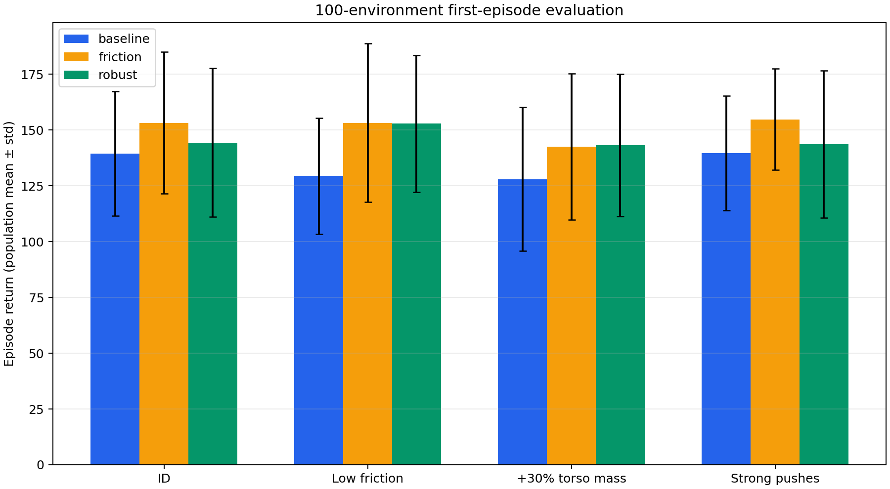
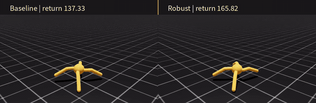
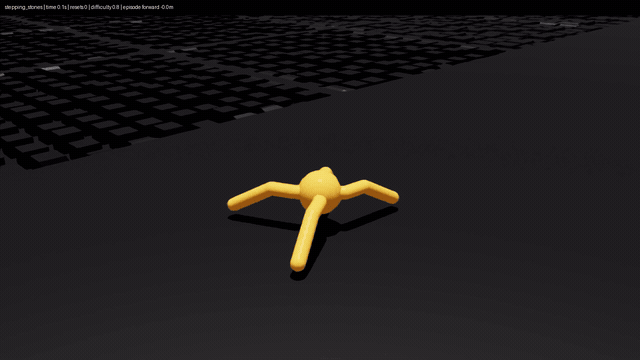

# Robust Ant PPO · Robotics Simulation Week 03

**같은 PPO·학습 예산에서 물성 랜덤화가 처음 보는 환경의 성능을 개선하는가?**
Isaac Lab `Isaac-Ant-v0`의 Baseline/Robust를 각 3개 학습 seed로 비교했습니다.
공개 OOD 3종의 평균 return은 **+10.8%** 개선됐으며, 과제 제출에는 **Robust seed42**를 선택했습니다.

[결과](#핵심-결과) · [주행 영상](#주행-영상) · [실행](#빠른-실행) ·
[최종 제출 가이드](docs/FINAL_SUBMISSION.md) · [전체 실험 기록](docs/EXPERIMENT_HISTORY.md)

## 최종 모델

- **과제 제출:** [Robust seed42 · `model_999.pt`](artifacts/runs/robust_seed42/model_999.pt)
  — 60D 관측 / 8D 행동. 기존 동일-budget 7개 run 중 **ID+3종 OOD 동등가중 종합 return 1위**입니다.
  모든 조건에서 1위는 아니며, 외란에서는 friction-only seed42가 더 높았습니다.
- **험지 데모:** [v5 portal-rehearsal round4](artifacts/terrain_demo/runs/rough_v5_portal_rehearsal4_seed43/model_round_4.pt)
  — 원래 과제와 별개인 후속 학습 모델입니다. v24까지 검토했으나 전체 교체 기준을 만족하지 않아 기본 데모로 유지합니다.

모델 선택·SHA-256·환경 설정·제출 항목은 [최종 제출 가이드](docs/FINAL_SUBMISSION.md)에 모았습니다.

## 핵심 결과

각 checkpoint를 **100환경의 첫 episode**, 평가 seed **24**, 최대 **960 steps(16초)**로 평가했습니다.
Baseline/Robust 집계는 학습 seed **42·43·44**, 각 조건 **300 episodes**입니다.
`±`는 episode return의 **population 표준편차**이며 신뢰구간이 아닙니다.

| 평가 조건 | Baseline · 3seed | Robust · 3seed | 평균 개선 | 제출 모델 · seed42 |
|---|---:|---:|---:|---:|
| ID | 139.38 ± 27.81 | 144.36 ± 33.31 | +3.6% | 156.15 ± 27.93 |
| 저마찰 | 129.37 ± 25.95 | 152.84 ± 30.67 | **+18.1%** | **162.01 ± 30.79** |
| 추가 하중 | 127.90 ± 32.20 | 143.19 ± 31.86 | **+12.0%** | 154.30 ± 28.06 |
| 강한 외란 | 139.53 ± 25.65 | 143.58 ± 32.97 | +2.9% | 153.04 ± 32.02 |

**3seed 연구 결론과 단일 제출 모델 선택은 구분합니다.** 제출 열은 Robust seed42의 100episode 결과입니다.
OOD `+10.8%`는 저마찰·하중·외란의 평균 return을 동등가중한 뒤 비교한 값입니다.
외란의 평균 episode length는 931.2 → 916.7로 줄었고, Robust의 학습 seed 간 변동도 더 컸습니다.
비공개 평가 성능이나 통계적 우월성을 보장하지 않습니다.



그래프의 friction-only는 **1개 학습 seed**의 보조 실험입니다.
[3seed 집계 CSV](artifacts/evaluations/evaluation_summary.csv) ·
[run별 결과 CSV](artifacts/evaluations/evaluation_per_run.csv) ·
[100환경 원시 JSON](artifacts/evaluations/) · [실험 설계](docs/EXPERIMENT_PLAN.md)

<details>
<summary>학습 곡선과 동일-budget 설정</summary>


모든 원래 과제 run은 동일한 60D/8D 인터페이스와 PPO를 사용합니다.
학습 예산은 4,096 envs × 32 steps × 1,000 iterations = **131,072,000 transitions/run**입니다.
Baseline/Robust는 각각 seed42/43/44, friction-only는 seed42입니다.
물성 범위와 설정은 [experiment matrix](configs/experiment_matrix.yaml)를 참고하세요.

</details>

## 주행 영상

**아래 재생 버튼으로 README 안에서 영상을 볼 수 있습니다.**
기존 약 16초의 원본 MP4를 그대로 첨부했습니다. 영상은 정성 데모이며,
위 100/300episode 집계를 대신하지 않습니다. [영상 첨부 기록](artifacts/readme_media/video_attachments_20260930.json)

### 저마찰: Baseline vs Robust

왼쪽 **Baseline seed42**, 오른쪽 **Robust seed42** — 같은 조건의 주행 비교입니다.
영상 안의 누적보상은 해당 1환경 주행값이며 결과표의 평균과 다릅니다.

https://github.com/user-attachments/assets/a5ec9894-7599-41d1-8e35-d3d4f8a93283

<details>
<summary>자동재생 GIF 미리보기 · 6 fps</summary>

[](artifacts/videos/comparison_low_friction_seed42.mp4)

</details>

[원본 비교 영상 · MP4](artifacts/videos/comparison_low_friction_seed42.mp4)

### 험지: v5 징검다리 복구 모델

과제 제출 모델이 아닌 **v5 데모 모델**의 난이도 0.8 징검다리 주행입니다.

https://github.com/user-attachments/assets/2b172615-49c5-4dad-8457-022b679414da

<details>
<summary>자동재생 GIF 미리보기 · 6 fps</summary>

[](artifacts/terrain_demo/rough_v5_rehearsal_stones08_seed7.mp4)

</details>

[복구 모델 원본 · MP4](artifacts/terrain_demo/rough_v5_rehearsal_stones08_seed7.mp4) ·
[동일 조건의 이전 v5 · MP4](artifacts/terrain_demo/rough_v5_reference_stones08_seed7.mp4) ·
[7개 지형 데모 · MP4](artifacts/terrain_demo/rough_v5_selected_seed7.mp4)

선택 후 새 지형의 짝 평가(험지 600episode/모델)에서는 이전 v5 대비
**1타일 통과 78.7% → 86.2%**, **6타일 통과 42.7% → 45.3%**였습니다(무낙상·레인 유지 기준).
낙상은 61/600으로 동일하며, 징검다리 6타일은 1/100에 그쳤습니다.
**모든 험지를 해결한 결과는 아닙니다.** [수치·판정·한계](docs/ROUGH_RECOVERY.md)

## 빠른 실행

**기존 수업 환경이 설치되어 있어야 합니다.** 검증 환경은 Python 3.11.16,
Isaac Sim 5.1.0, Isaac Lab 2.3.0, PyTorch 2.7.0+cu128, RSL-RL 3.0.1입니다.
저장소 루트에서 실행하고, 다른 PC에서는 course 경로를 바꾸세요.

```bash
export ROBOTICS_SIM_CLASS_ROOT=/mnt/ssd970/robotics_simulation_class
source "$ROBOTICS_SIM_CLASS_ROOT/activate.sh"
python -m pip install --no-deps -e .
CHECKPOINT=artifacts/runs/robust_seed42/model_999.pt
```

### 과제용 100환경 평가

```bash
./scripts/run_evaluate.sh \
  --task Week03-Ant-Baseline-v0 --headless --device cuda:0 \
  --num_envs 100 --seed 24 --max_steps 960 \
  --checkpoint "$CHECKPOINT" \
  --output outputs/submission_eval/id.json \
  --kit_args=--/renderer/multiGpu/enabled=false
```

`Baseline-v0`는 **평가 환경**을 고르는 옵션입니다. 로드한 Robust 모델을 바꾸지 않습니다.
ID와 공개 OOD 3종 전체 재평가는 다음과 같습니다. label이 같은 기존 결과는 교체됩니다.

```bash
./scripts/evaluate_checkpoint.sh submission_recheck "$CHECKPOINT" 0
```

### GUI 평가 데모

```bash
./scripts/run_evaluate.sh \
  --task Week03-Ant-Baseline-v0 --device cuda:0 \
  --num_envs 1 --seed 24 --max_steps 960 --real-time \
  --checkpoint "$CHECKPOINT" \
  --kit_args=--/renderer/multiGpu/enabled=false
```

영상 저장 옵션과 별도 험지 데모 명령은 [최종 가이드의 GUI/영상](docs/FINAL_SUBMISSION.md#4-gui-재생--영상),
[험지 실행](docs/FINAL_SUBMISSION.md#6-험지-실험-마무리--과제-제출과-분리)을 참고하세요.

## 학습 재현

제출 모델 실행에 재학습은 필요하지 않습니다. 동일 예산의 Robust seed42 재학습 예:

```bash
./scripts/run_train.sh \
  --task Week03-Ant-Robust-v0 --headless --device cuda:0 \
  --num_envs 4096 --max_iterations 1000 --seed 42 \
  --run_name robust_reproduction_seed42
```

공정 비교에는 Baseline/Robust 모두 seed42/43/44를 사용합니다.
원래 실행 래퍼는 `./scripts/run_experiment.sh <baseline|friction|robust> <seed> <cuda-index>`이며,
[설계·랜덤화 범위](docs/EXPERIMENT_PLAN.md)와 [전체 실행 안내](docs/FINAL_SUBMISSION.md)를 참고하세요.
후속 험지의 추가 학습 예산을 원래 과제 비교에 합치지 않습니다.

## 실험 기록·제출 자료

| 자료 | 내용 |
|---|---|
| [최종 제출 가이드](docs/FINAL_SUBMISSION.md) | 모델 선택·해시·평가·GUI·설치·검증 명령 |
| [전체 실험 기록 · v0–v24](docs/EXPERIMENT_HISTORY.md) | 진행 과정, 실패 사례, 부분 개선, 최종 판단 |
| [험지 복구 결과](docs/ROUGH_RECOVERY.md) | v5 모델 비교와 성공 기준·한계 |
| [5분 발표 PPT](report/week03_ant_robust_report.pptx) · [발표 대본](report/SPEAKER_NOTES.md) | 원래 과제의 3seed 실험 발표 |
| [제출 체크리스트](docs/SUBMISSION_CHECKLIST.md) · [팀원 정보](TEAM.md) | 과제 요구사항, 팀원/LMS 입력 항목 |
| [공개 범위·검증](docs/PUBLICATION.md) | 배포 파일, 로컬 원문 의존성, 재현 시 주의사항 |

험지 v6–v24에는 확장 관측과 별도 loader가 있어 원래 60D 평가기에 그대로 넣지 않습니다.
깊이 관측은 **이상적인 ray/height scan**이며 실제 RGB-D·실물 로봇 검증이 아닙니다.

공개 파일 무결성은 `sha256sum -c artifacts/PUBLICATION_SHA256SUMS`로 확인합니다.
공개 checkout에서 검증한 CPU subset은 **147개**이며, 전체 2,056개 suite는 보존된 로컬 원문이 필요합니다.
테스트 명령과 제한은 [최종 확인](docs/FINAL_SUBMISSION.md#7-제출-요구사항-대응--마지막-확인)에 있습니다.

소스는 [BSD-3-Clause](LICENSE)이며, Isaac Lab/RSL-RL 관련 원 고지는
[THIRD_PARTY_NOTICES.md](THIRD_PARTY_NOTICES.md)에 유지합니다. 시뮬레이터·SDK·로봇 asset은 배포하지 않습니다.
