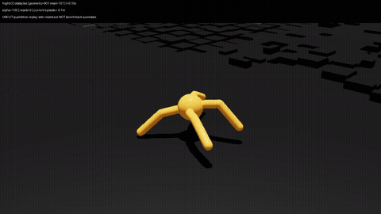
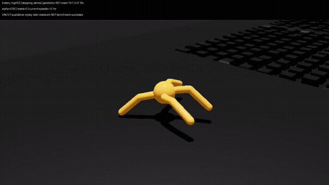

# Robust Ant PPO · Robotics Simulation Week 03

**기본 제공 코드로 학습한 Baseline과 최종 모델을 같은 조건에서 비교합니다.**
과제 제출 모델은 **Robust seed42**입니다. 저마찰·험지 모두 **이 동일 checkpoint**를 사용합니다.
두 비교의 왼쪽도 동일한 **제공 코드 Baseline seed42**입니다. 추가 험지 학습은 하지 않았습니다.

[성능](#과제-성능--제공-코드-baseline-대비) · [비교 영상](#비교-영상) · [미사용 지형](#학습-미사용-지형-평가) ·
[실행](#빠른-실행) · [동일 모델·험지 재현](docs/SAME_CHECKPOINT_COMPARISON.md) ·
[전체 실험 기록](docs/EXPERIMENT_HISTORY.md)

## 비교 기준·최종 모델

- **기본 제공 코드 Baseline:** [`baseline_seed42/model_999.pt`](artifacts/runs/baseline_seed42/model_999.pt)
  — 무수정 `Isaac-Ant-v0` 환경·`AntPPORunnerCfg`로 **직접 학습**한 모델입니다.
  제공받은 pretrained weight가 아닙니다. 프로젝트의 `Baseline-v0`는 제공 환경의 빈 subclass입니다.
- **과제 제출:** [`robust_seed42/model_999.pt`](artifacts/runs/robust_seed42/model_999.pt)
  — Baseline과 동일한 PPO·예산·60D 관측/8D 행동에 물성 랜덤화를 추가했습니다.
  기존 동일-budget 7run 중 ID+3종 OOD 동등가중 종합 return으로 선택했으며, 모든 조건의 1위는 아닙니다.

**둘 다 `training seed42`인 이유:** 비교를 위해 학습 난수 seed를 맞춘 것입니다.
Baseline은 기본 설정, Robust는 랜덤화 추가 설정으로 **각각 학습한 다른 가중치**입니다.
seed는 모델 ID가 아닙니다. 환경을 바꿀 때 각 모델 파일의 SHA는 그대로 유지했습니다.
이전 추가 학습 v5 비교는 [별도 연구 이력](docs/PROVIDED_BASELINE_COMPARISON.md#험지-전이-비교)으로 보존합니다.

## 과제 성능 — 제공 코드 Baseline 대비

**2026-09-30 새 짝 평가:** 두 모델 모두 학습 seed **42**, 동일 예산
**4,096 envs × 32 steps × 1,000 iterations**입니다.
조건별 **100환경 첫 episode**, 평가 seed **24**, 최대 **960 steps(16초)**로 비교했습니다.
ID는 실제 제공 task **`Isaac-Ant-v0`**를 사용했습니다. `±`는 episode population 표준편차입니다.

| 조건 | 제공 코드 Baseline42 | 제출 Robust42 | 평균 return 변화 |
|---|---:|---:|---:|
| ID | 144.89 ± 15.12 | 154.32 ± 29.32 | +6.5% |
| 저마찰 | 132.97 ± 19.79 | **161.69 ± 30.23** | **+21.6%** |
| 추가 하중 | 133.01 ± 30.86 | 155.44 ± 27.81 | +16.9% |
| 강한 외란 | 143.28 ± 21.16 | 150.68 ± 34.99 | +5.2% |

OOD 3종의 동등가중 평균 return은 **136.42 → 155.94 (+14.3%)**입니다.
**단일 학습 seed의 제출 모델 대조**이며, 3seed 일반화 결론이나 통계적 우월성 보장이 아닙니다.
새 실행의 일부 Robust 수치는 과거 기록과 다릅니다. 과거 결과는 덮어쓰지 않았고 원인을 분리 검증하지 않았습니다.


[새 결과 CSV](artifacts/provided_baseline_comparison_20260930/course_results.csv) ·
[원시 episode JSON](artifacts/provided_baseline_comparison_20260930/evaluations/) ·
[조건·모델 SHA·집계](artifacts/provided_baseline_comparison_20260930/summary.json)

<details>
<summary>기존 3seed 연구 결과 · 새 단일 모델 비교와 구분</summary>

기존 Baseline/Robust 학습 seed42·43·44, 조건별300 episodes의 보존된 결과입니다.
OOD 동등가중 평균 개선은 **+10.8%**였으며, 위 새 seed42 비교와 섞지 않습니다.

| 조건 | 제공 코드 Baseline · 3seed | Robust · 3seed | 평균 개선 |
|---|---:|---:|---:|
| ID | 139.38 ± 27.81 | 144.36 ± 33.31 | +3.6% |
| 저마찰 | 129.37 ± 25.95 | 152.84 ± 30.67 | +18.1% |
| 추가 하중 | 127.90 ± 32.20 | 143.19 ± 31.86 | +12.0% |
| 강한 외란 | 139.53 ± 25.65 | 143.58 ± 32.97 | +2.9% |

외란의 평균 episode length는931.2 → 916.7로 줄었고 Robust의 학습 seed 간 변동도 더 컸습니다.
[보존된 집계](artifacts/evaluations/evaluation_summary.csv) · [실험 설계](docs/EXPERIMENT_PLAN.md)


</details>

## 험지 전이 성능 — 동일 제출 모델 그대로

**저마찰과 동일한 Baseline42·Robust42 파일을 그대로 넣었습니다.**
두 모델의 원래 학습 예산은 같고 추가 험지 학습은 없습니다.
task 이름의 `v5`는 **평가 환경 버전이지 모델 이름이 아닙니다.**
높이·목표·방향 관측의 의미와 보상·종료 조건은 원래 Ant와 달라 **별도 전이 성능**입니다.

| 험지 600episode/모델 | 제공 코드 Baseline42 | 제출 Robust42 |
|---|---:|---:|
| 엄격한 1타일 통과 | 112/600 · 18.7% | 48/600 · 8.0% |
| 엄격한 6타일 통과 | 0/600 · 0.0% | 0/600 · 0.0% |
| 낙상·전복 종료 | 290/600 · 48.3% | 195/600 · 32.5% |
| footprint 레인 이탈 | 50/600 | 64/600 |

통과는 **거리 기준 + episode 무낙상 + 발 범위 레인 유지 + 월드 유지**를 모두 만족해야 합니다.
같은 geometry/reset **51/28·51/29·54/30·55/30**, 조합당175환경의 첫 episode입니다.
평탄 레인100회는 위 분모에서 제외하며 낙상은 **8 → 9**입니다.
**Robust는 낙상이 줄었지만 통과율·속도는 낮아지고 레인 이탈은 늘었습니다.**
험지 평균 속도는 **1.48 → 0.92m/s**, 징검다리 6타일은 둘 다 **0/100**입니다.
과제의 물성 변화 개선을 험지 보행 개선으로 해석하지 않습니다.


[새 험지 CSV](artifacts/same_checkpoint_terrain_20260930/terrain_results.csv) ·
[판정·한계·재현](docs/SAME_CHECKPOINT_COMPARISON.md) ·
[기존 v5끼리의 비교 이력](docs/ROUGH_RECOVERY.md)

## 비교 영상

저마찰은 아래 재생 버튼으로, 교정한 험지는 GIF 미리보기·MP4 링크로 볼 수 있습니다.
**두 영상 모두 왼쪽은 Baseline42, 오른쪽은 동일한 제출 Robust42입니다.**
새로 녹화한 전체 **16초**를 같은 재생 속도로 나란히 배치했습니다.
영상은 정성 데모이며, 위100/600episode 결과를 대신하지 않습니다.

### 저마찰 · 제공 코드 Baseline vs 제출 Robust

같은100환경 평가 실행에서 env0을 녹화했습니다(평가 seed24).
두 모델의 PPO 예산은 같으며 reset 후 화면도 포함됩니다.

<!-- NATIVE_VIDEO_LOW_FRICTION -->
https://github.com/user-attachments/assets/8ded3f05-2d7b-4f9c-8737-58ea6ae81ed1

<details>
<summary>자동재생 GIF 미리보기 · 6 fps</summary>

[](artifacts/provided_baseline_comparison_20260930/videos/provided_baseline_vs_robust_low_friction.mp4)

</details>

### 징검다리 · 제공 코드 Baseline vs 동일 제출 Robust

난이도 **0.8**, geometry **51**, reset **7**, 1환경의 별도 전이 데모입니다.
저마찰과 모델 SHA가 같습니다: Baseline `f4a88747…`, Robust `58dc882b…`.
영상의 `resets`는 낙상 수가 아니며 마지막에는16초 자동 reset이 포함됩니다.

<!-- NATIVE_VIDEO_STONES08 -->
[동일 Robust42로 다시 녹화한 전체 비교 MP4](artifacts/same_checkpoint_terrain_20260930/videos/provided_baseline_vs_robust_seed42_stones08.mp4)

새 GitHub 재생 첨부는 게시 전입니다. 이전 추가 학습 v5 영상과 혼동하지 않도록 교체했습니다.

[](artifacts/same_checkpoint_terrain_20260930/videos/provided_baseline_vs_robust_seed42_stones08.mp4)

[교정한 험지·개별 원본 MP4](artifacts/same_checkpoint_terrain_20260930/videos/) ·
[험지 영상 조건·SHA·전체 decode](artifacts/same_checkpoint_terrain_20260930/media_manifest.json) ·
[기존 저마찰 첨부 검증](artifacts/provided_baseline_comparison_20260930/native_video_verification.json)

## 학습 미사용 지형 평가

**추가 험지 학습 모델 v5/v16/high53의 별도 비교**이며 위 과제 제출 Robust42 전이 실험과 다릅니다.
학습 설정159개/geometry seed17개와 겹치지 않는 **901/902 배치**에서5제어기를 같은 초기 상태·RNG로 평가했습니다.
기존 지형 종류의 새로운 배치이지, 훈련 생성기 밖의 새 지형 종류 OOD 검증은 아닙니다.

| 범위 | 최고 설정 | 엄격한6타일 성공 | 같은 조건 대조 |
|---|---|---:|---|
|16초 혼합험지|v16 control 단독|**177/300 · 59.0%**|history v16 167/300|
|64초 혼합험지|v5 ↔ high53 history 교체|**236/300 · 78.7%**|high53 단독223/300|
|64초 장애물만|high53 단독|**38/50 · 76.0%**|history high53 32/50|

**장기 혼합험지에서는 교체가 좋았지만 모든 지형·지표에서 최고는 아닙니다.**
history high53의64초 험지 낙상은 단독52→58, 평지 낙상3→7/50·속도12.170→10.043m/s였습니다.
전환기는 지형 이름별 전용 모델 배정이 아니라 높이 ray 이력에 따른 두 정책 혼합입니다.
v5도 이미 평지·험지를 함께 학습했으므로 순수 평지/험지 모델 분리 실험은 아닙니다.
총1,750개 물리적 첫episode에서3,500개 **종속**16/64초 window를 채점했습니다.

### 새 배치 · 최고 난도 장애물과 징검다리 데모

geometry901/reset101, 난도1.0, 한 환경의 **16초 무편집 원본**입니다.
GIF는 전체 시간축을6fps로 낮춘 미리보기입니다. 클릭하면 원본 MP4를 열거나 다운로드할 수 있습니다.
이 정성 사례는 위 반복 평가의 성공률과 합산하지 않습니다.

**장애물 최고 후보 high53 단독**

[](artifacts/unseen_obstacles_20261001/videos/GUI_high53__obstacles_g901_r101.mp4)

**장기 혼합험지 최고 후보 history high53 · 징검다리**

[](artifacts/unseen_obstacles_20261001/videos/GUI_history_high53__stones_g901_r101.mp4)

[원본 영상5개·모델별 비교](artifacts/unseen_obstacles_20261001/videos/) ·
[전체 수치·지형/난도별 집계](artifacts/unseen_obstacles_20261001/summary/summary.json) ·
[조건·SHA·재현·한계](docs/UNSEEN_OBSTACLE_DEMO.md) ·
[영상 전체decode·preview 검증](artifacts/unseen_obstacles_20261001/media_manifest.json)

## 빠른 실행

기존 수업 환경이 필요합니다: Python3.11.16, Isaac Sim5.1.0, Isaac Lab2.3.0,
PyTorch2.7.0+cu128, RSL-RL3.0.1. 저장소 루트에서 실행하고 다른 PC는 course 경로를 바꾸세요.

```bash
export ROBOTICS_SIM_CLASS_ROOT=/mnt/ssd970/robotics_simulation_class
source "$ROBOTICS_SIM_CLASS_ROOT/activate.sh"
python -m pip install --no-deps -e .
CHECKPOINT=artifacts/runs/robust_seed42/model_999.pt

# 제공 task에서 제출 모델의 100환경 첫 episode 평가
./scripts/run_evaluate.sh \
  --task Isaac-Ant-v0 --headless --device cuda:0 \
  --num_envs 100 --seed 24 --max_steps 960 \
  --checkpoint "$CHECKPOINT" --output outputs/submission_eval/id.json \
  --kit_args=--/renderer/multiGpu/enabled=false
```

기본 Baseline을 평가하려면 checkpoint만 `artifacts/runs/baseline_seed42/model_999.pt`로 바꿉니다.
[두 모델×4조건 재평가·녹화 명령](docs/PROVIDED_BASELINE_COMPARISON.md#과제-비교-재현)을 제공합니다.

### GUI 평가 데모

```bash
./scripts/run_evaluate.sh \
  --task Isaac-Ant-v0 --device cuda:0 \
  --num_envs 1 --seed 24 --max_steps 960 --real-time \
  --checkpoint "$CHECKPOINT" \
  --kit_args=--/renderer/multiGpu/enabled=false
```

험지 두 모델의 같은 조건 데모·평가는 [동일 모델 재현 명령](docs/SAME_CHECKPOINT_COMPARISON.md#험지-평가녹화-재현),
전체 설치·과제 제출 항목은 [최종 제출 가이드](docs/FINAL_SUBMISSION.md)에 있습니다.

## 학습 재현

실행에 재학습은 필요하지 않습니다. 동일 예산의 Robust seed42 재학습 예:

```bash
./scripts/run_train.sh \
  --task Week03-Ant-Robust-v0 --headless --device cuda:0 \
  --num_envs 4096 --max_iterations 1000 --seed 42 \
  --run_name robust_reproduction_seed42
```

제공 코드 Baseline은 task를 `Week03-Ant-Baseline-v0`로 바꿉니다.
3seed 연구 재현에는 두 모델 모두 seed42/43/44를 사용합니다.
[설계·랜덤화 범위](docs/EXPERIMENT_PLAN.md) · [experiment matrix](configs/experiment_matrix.yaml)

## 실험 기록·제출 자료

| 자료 | 내용 |
|---|---|
| [미사용 지형 평가·데모](docs/UNSEEN_OBSTACLE_DEMO.md) | 새2배치·5제어기·단기/장기/장애물 최고 설정·원본5영상 |
| [동일 checkpoint 험지 비교](docs/SAME_CHECKPOINT_COMPARISON.md) | 저마찰·험지 모델 일치·수치·영상·재현 |
| [기본 제공 코드 비교 기록](docs/PROVIDED_BASELINE_COMPARISON.md) | 현재 과제 수치·이전 추가 학습 v5 기록 |
| [최종 제출 가이드](docs/FINAL_SUBMISSION.md) | 모델 선택·설치·평가·GUI·검증 |
| [전체 실험 기록 · v0–v24](docs/EXPERIMENT_HISTORY.md) | 성공·실패·부분 개선·최종 판단 |
| [기존 험지 복구 연구](docs/ROUGH_RECOVERY.md) | v5끼리의 비교와 후속 학습 이력 |
| [5분 발표 PPT](report/week03_ant_robust_report.pptx) · [대본](report/SPEAKER_NOTES.md) | 기존 3seed 연구 발표 |
| [제출 체크리스트](docs/SUBMISSION_CHECKLIST.md) · [팀원 정보](TEAM.md) | 과제 요구사항·LMS 항목 |
| [공개 범위·검증](docs/PUBLICATION.md) | 배포 파일·재현 제약 |

기존 소스·체크포인트·과거 결과/영상은 보존합니다. v6–v24 확장 관측 모델은 원래60D 평가기에 넣지 않습니다.
실물·비공개 평가·실제 RGB-D는 미검증입니다. 공개 CPU subset **147개**, 전체2,056개 suite는 로컬 원문이 필요합니다.
무결성: `sha256sum -c artifacts/PUBLICATION_SHA256SUMS`.
[BSD-3-Clause](LICENSE) · [원 라이선스 고지](THIRD_PARTY_NOTICES.md)
