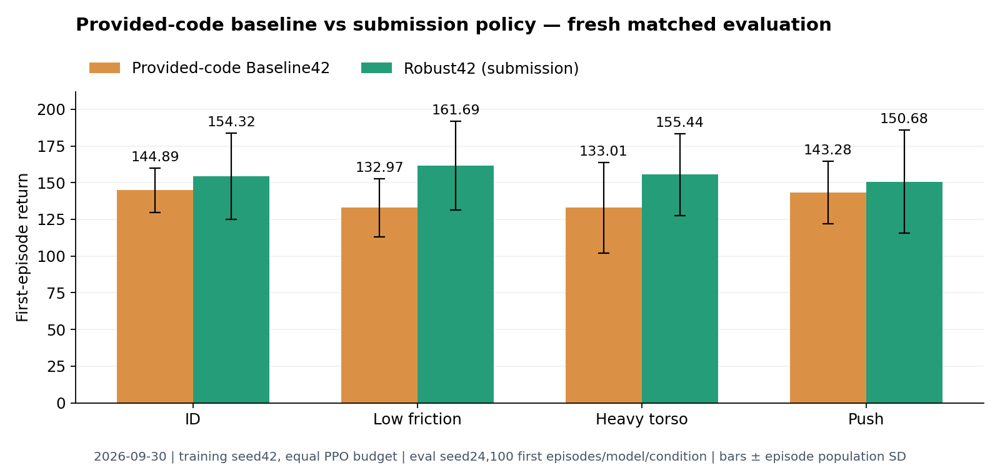
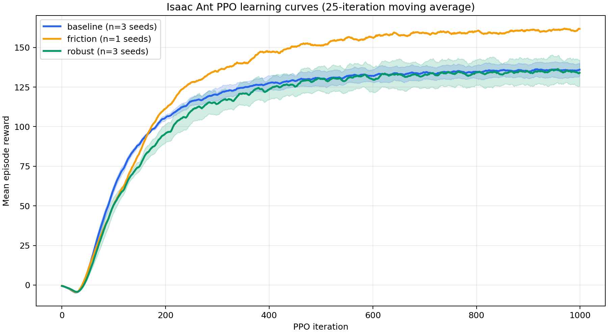
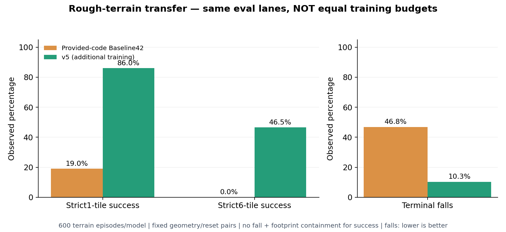
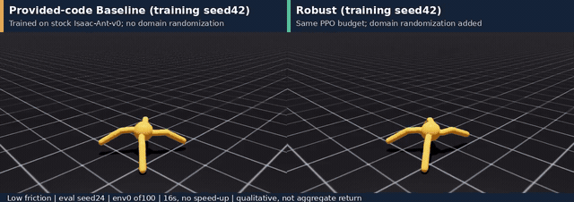
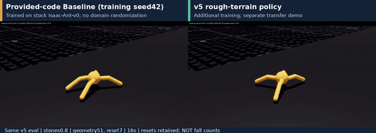

# Robust Ant PPO · Robotics Simulation Week 03

**기본 제공 코드로 학습한 Baseline과 최종 모델을 같은 조건에서 비교합니다.**
과제 제출 모델은 **Robust seed42**, 별도 험지 데모는 **v5 복구 모델**입니다.
아래 성능표와 두 비교 영상의 기준은 모두 **제공 코드 Baseline seed42**입니다.

[성능](#과제-성능--제공-코드-baseline-대비) · [비교 영상](#비교-영상) ·
[실행](#빠른-실행) · [비교 기준·재현](docs/PROVIDED_BASELINE_COMPARISON.md) ·
[전체 실험 기록](docs/EXPERIMENT_HISTORY.md)

## 비교 기준·최종 모델

- **기본 제공 코드 Baseline:** [`baseline_seed42/model_999.pt`](artifacts/runs/baseline_seed42/model_999.pt)
  — 무수정 `Isaac-Ant-v0` 환경·`AntPPORunnerCfg`로 **직접 학습**한 모델입니다.
  제공받은 pretrained weight가 아닙니다. 프로젝트의 `Baseline-v0`는 제공 환경의 빈 subclass입니다.
- **과제 제출:** [`robust_seed42/model_999.pt`](artifacts/runs/robust_seed42/model_999.pt)
  — Baseline과 동일한 PPO·예산·60D 관측/8D 행동에 물성 랜덤화를 추가했습니다.
  기존 동일-budget 7run 중 ID+3종 OOD 동등가중 종합 return으로 선택했으며, 모든 조건의 1위는 아닙니다.
- **험지 데모:** [v5 portal-rehearsal round4](artifacts/terrain_demo/runs/rough_v5_portal_rehearsal4_seed43/model_round_4.pt)
  — **추가 험지 학습** 모델입니다. 원래 과제용 Robust를 대신하지 않습니다.

## 과제 성능 — 제공 코드 Baseline 대비

**2026-09-30 새 짝 평가:** 두 모델 모두 학습 seed **42**, 동일 예산
**4,096 envs × 32 steps × 1,000 iterations**입니다.
조건별 **100환경 첫 episode**, 평가 seed **24**, 최대 **960 steps(16초)**로 비교했습니다.
ID는 실제 제공 task **`Isaac-Ant-v0`**를 사용했습니다. `±`는 episode population 표준편차입니다.

| 조건 | 제공 코드 Baseline42 | 제출 Robust42 | 평균 return 변화 |
|---|---:|---:|---:|
| ID | 144.89 ± 15.12 | 154.32 ± 29.32 | +6.5% |
| 저마찰 | 132.97 ± 19.79 | **161.69 ± 30.23** | **+21.6%** |
| 추가 하중 | 133.01 ± 30.86 | 155.44 ± 27.81 | +16.9% |
| 강한 외란 | 143.28 ± 21.16 | 150.68 ± 34.99 | +5.2% |

OOD 3종의 동등가중 평균 return은 **136.42 → 155.94 (+14.3%)**입니다.
**단일 학습 seed의 제출 모델 대조**이며, 3seed 일반화 결론이나 통계적 우월성 보장이 아닙니다.
새 실행의 일부 Robust 수치는 과거 기록과 다릅니다. 과거 결과는 덮어쓰지 않았고 원인을 분리 검증하지 않았습니다.



[새 결과 CSV](artifacts/provided_baseline_comparison_20260930/course_results.csv) ·
[원시 episode JSON](artifacts/provided_baseline_comparison_20260930/evaluations/) ·
[조건·모델 SHA·집계](artifacts/provided_baseline_comparison_20260930/summary.json)

<details>
<summary>기존 3seed 연구 결과 · 새 단일 모델 비교와 구분</summary>

기존 Baseline/Robust 학습 seed42·43·44, 조건별300 episodes의 보존된 결과입니다.
OOD 동등가중 평균 개선은 **+10.8%**였으며, 위 새 seed42 비교와 섞지 않습니다.

| 조건 | 제공 코드 Baseline · 3seed | Robust · 3seed | 평균 개선 |
|---|---:|---:|---:|
| ID | 139.38 ± 27.81 | 144.36 ± 33.31 | +3.6% |
| 저마찰 | 129.37 ± 25.95 | 152.84 ± 30.67 | +18.1% |
| 추가 하중 | 127.90 ± 32.20 | 143.19 ± 31.86 | +12.0% |
| 강한 외란 | 139.53 ± 25.65 | 143.58 ± 32.97 | +2.9% |

외란의 평균 episode length는931.2 → 916.7로 줄었고 Robust의 학습 seed 간 변동도 더 컸습니다.
[보존된 집계](artifacts/evaluations/evaluation_summary.csv) · [실험 설계](docs/EXPERIMENT_PLAN.md)



</details>

## 험지 전이 성능 — 같은 Baseline 대비

**원래 과제와 별도입니다.** 두 모델을 같은 v5 평가 레인에 넣었습니다.
v5는 관측의 높이·목표·방향 의미와 보상·종료 조건이 바뀌며 추가 학습도 있으므로,
**동일 학습 예산의 인과 비교나 과제 점수가 아닌 전이 성능**입니다.

| 험지 600episode/모델 | 제공 코드 Baseline42 | 추가 학습 v5 |
|---|---:|---:|
| 엄격한 1타일 통과 | 114/600 · 19.0% | **516/600 · 86.0%** |
| 엄격한 6타일 통과 | 0/600 · 0.0% | **279/600 · 46.5%** |
| 낙상·전복 종료 | 281/600 · 46.8% | **62/600 · 10.3%** |
| footprint 레인 이탈 | 51/600 | 2/600 |

통과는 **거리 기준 + episode 무낙상 + 발 범위 레인 유지 + 월드 유지**를 모두 만족해야 합니다.
같은 geometry/reset **51/28·51/29·54/30·55/30**, 조합당175환경의 첫 episode입니다.
평탄 레인100회는 위 분모에서 제외하며 낙상은 **8 → 12**로 늘었습니다.
징검다리 6타일은 여전히 **3/100**입니다. **모든 험지를 해결한 결과는 아닙니다.**



[새 험지 CSV](artifacts/provided_baseline_comparison_20260930/terrain_results.csv) ·
[판정·한계·재현](docs/PROVIDED_BASELINE_COMPARISON.md#험지-전이-비교) ·
[기존 v5끼리의 비교 이력](docs/ROUGH_RECOVERY.md)

## 비교 영상

**아래 재생 버튼으로 README 안에서 볼 수 있습니다.**
**두 영상 모두 왼쪽은 제공 코드 Baseline seed42입니다.**
새로 녹화한 전체 **16초**를 같은 재생 속도로 나란히 배치했습니다.
영상은 정성 데모이며, 위100/600episode 결과를 대신하지 않습니다.

### 저마찰 · 제공 코드 Baseline vs 제출 Robust

같은100환경 평가 실행에서 env0을 녹화했습니다(평가 seed24).
두 모델의 PPO 예산은 같으며 reset 후 화면도 포함됩니다.

<!-- NATIVE_VIDEO_LOW_FRICTION -->
https://github.com/user-attachments/assets/8ded3f05-2d7b-4f9c-8737-58ea6ae81ed1

<details>
<summary>자동재생 GIF 미리보기 · 6 fps</summary>

[](artifacts/provided_baseline_comparison_20260930/videos/provided_baseline_vs_robust_low_friction.mp4)

</details>

### 징검다리 · 제공 코드 Baseline vs 추가 학습 v5

난이도 **0.8**, geometry **51**, reset **7**, 1환경의 별도 전이 데모입니다.
영상의 `resets`는 낙상 수가 아니며 마지막에는16초 자동 reset이 포함됩니다.

<!-- NATIVE_VIDEO_STONES08 -->
https://github.com/user-attachments/assets/7411e0a8-c948-463c-88c9-77b626ea608d

<details>
<summary>자동재생 GIF 미리보기 · 6 fps</summary>

[](artifacts/provided_baseline_comparison_20260930/videos/provided_baseline_vs_v5_stones08.mp4)

</details>

[비교·개별 원본 MP4](artifacts/provided_baseline_comparison_20260930/videos/) ·
[영상 조건·해시·전체 decode](artifacts/provided_baseline_comparison_20260930/media_manifest.json) ·
[첨부·표시 검증](artifacts/provided_baseline_comparison_20260930/native_video_verification.json)

## 빠른 실행

기존 수업 환경이 필요합니다: Python3.11.16, Isaac Sim5.1.0, Isaac Lab2.3.0,
PyTorch2.7.0+cu128, RSL-RL3.0.1. 저장소 루트에서 실행하고 다른 PC는 course 경로를 바꾸세요.

```bash
export ROBOTICS_SIM_CLASS_ROOT=/mnt/ssd970/robotics_simulation_class
source "$ROBOTICS_SIM_CLASS_ROOT/activate.sh"
python -m pip install --no-deps -e .
CHECKPOINT=artifacts/runs/robust_seed42/model_999.pt

# 제공 task에서 제출 모델의 100환경 첫 episode 평가
./scripts/run_evaluate.sh \
  --task Isaac-Ant-v0 --headless --device cuda:0 \
  --num_envs 100 --seed 24 --max_steps 960 \
  --checkpoint "$CHECKPOINT" --output outputs/submission_eval/id.json \
  --kit_args=--/renderer/multiGpu/enabled=false
```

기본 Baseline을 평가하려면 checkpoint만 `artifacts/runs/baseline_seed42/model_999.pt`로 바꿉니다.
[두 모델×4조건 재평가·녹화 명령](docs/PROVIDED_BASELINE_COMPARISON.md#과제-비교-재현)을 제공합니다.

### GUI 평가 데모

```bash
./scripts/run_evaluate.sh \
  --task Isaac-Ant-v0 --device cuda:0 \
  --num_envs 1 --seed 24 --max_steps 960 --real-time \
  --checkpoint "$CHECKPOINT" \
  --kit_args=--/renderer/multiGpu/enabled=false
```

험지 두 모델의 같은 조건 데모·평가는 [험지 재현 명령](docs/PROVIDED_BASELINE_COMPARISON.md#험지-비교-재현),
전체 설치·과제 제출 항목은 [최종 제출 가이드](docs/FINAL_SUBMISSION.md)에 있습니다.

## 학습 재현

실행에 재학습은 필요하지 않습니다. 동일 예산의 Robust seed42 재학습 예:

```bash
./scripts/run_train.sh \
  --task Week03-Ant-Robust-v0 --headless --device cuda:0 \
  --num_envs 4096 --max_iterations 1000 --seed 42 \
  --run_name robust_reproduction_seed42
```

제공 코드 Baseline은 task를 `Week03-Ant-Baseline-v0`로 바꿉니다.
3seed 연구 재현에는 두 모델 모두 seed42/43/44를 사용합니다.
[설계·랜덤화 범위](docs/EXPERIMENT_PLAN.md) · [experiment matrix](configs/experiment_matrix.yaml)

## 실험 기록·제출 자료

| 자료 | 내용 |
|---|---|
| [이번 기본 제공 코드 비교](docs/PROVIDED_BASELINE_COMPARISON.md) | 정의·새 수치·영상·SHA·한계·재현 |
| [최종 제출 가이드](docs/FINAL_SUBMISSION.md) | 모델 선택·설치·평가·GUI·검증 |
| [전체 실험 기록 · v0–v24](docs/EXPERIMENT_HISTORY.md) | 성공·실패·부분 개선·최종 판단 |
| [기존 험지 복구 연구](docs/ROUGH_RECOVERY.md) | v5끼리의 비교와 후속 학습 이력 |
| [5분 발표 PPT](report/week03_ant_robust_report.pptx) · [대본](report/SPEAKER_NOTES.md) | 기존 3seed 연구 발표 |
| [제출 체크리스트](docs/SUBMISSION_CHECKLIST.md) · [팀원 정보](TEAM.md) | 과제 요구사항·LMS 항목 |
| [공개 범위·검증](docs/PUBLICATION.md) | 배포 파일·재현 제약 |

기존 소스·체크포인트·과거 결과/영상은 보존합니다. v6–v24 확장 관측 모델은 원래60D 평가기에 넣지 않습니다.
실물·비공개 평가·실제 RGB-D는 미검증입니다. 공개 CPU subset **147개**, 전체2,056개 suite는 로컬 원문이 필요합니다.
무결성: `sha256sum -c artifacts/PUBLICATION_SHA256SUMS`.
[BSD-3-Clause](LICENSE) · [원 라이선스 고지](THIRD_PARTY_NOTICES.md)
