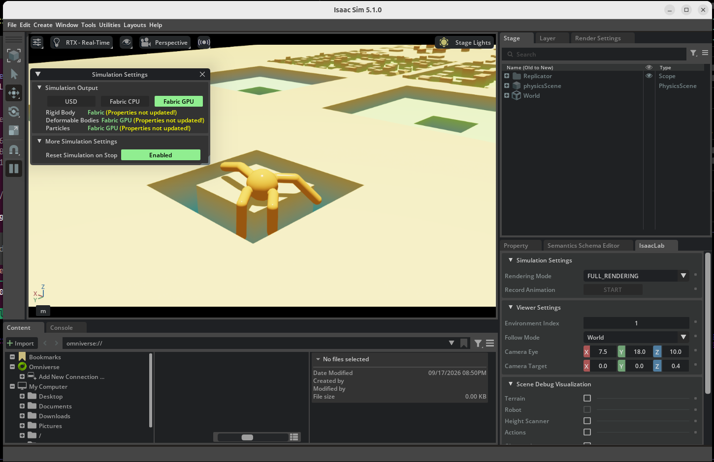

# Multi-terrain Ant demo

The original Week 03 submission evaluates dynamics randomization on the course
flat-ground task. This directory contains an additional terrain-generalization
extension trained in the same Isaac Lab 2.3.0 environment.

## Terrain set

`Week03-Ant-Terrain-v0` keeps the original 60-dimensional observation and
8-dimensional action interfaces, but replaces the plane with four equally
represented procedural families:

- flat plane
- random height-field roughness
- pyramid slope
- pyramid stairs

Torso height observations and fall termination are measured relative to each
terrain patch's origin. This prevents elevated patches from changing the meaning
of the original base-height feature.

## Training and selection

The selected policy was trained from scratch for 1,000 PPO iterations on the
full terrain curriculum, then fine-tuned for 600 iterations on a moderate
curriculum (`difficulty_range=(0.0, 0.45)`). It is stored at:

```text
artifacts/terrain_demo/runs/terrain_mild_seed42/model_1598.pt
```

SHA-256:

```text
1bc0f6d4e255f179aa4ad9b4392e19425c0503a63319730d2b68c338ad59fa2a
```

The full 100-environment evaluation uses seed 24, 25 environments per terrain
family, and one episode of at most 960 control steps per environment.

| Policy | Mean return | Return std | Mean length | Full-length episodes |
|---|---:|---:|---:|---:|
| Original robust checkpoint | 15.71 | 15.50 | 270.95 | 6/100 |
| Full-terrain fine-tune | 21.78 | 15.28 | 504.24 | 15/100 |
| Full-terrain scratch | 31.96 | 15.98 | 574.83 | 11/100 |
| **Selected moderate fine-tune** | **33.00** | **16.36** | **595.15** | **19/100** |

Selected-policy breakdown:

| Terrain | Episodes | Mean return | Return std | Mean length | Full length |
|---|---:|---:|---:|---:|---:|
| Flat | 25 | 33.61 | 15.43 | 580.44 | 2 |
| Random rough | 25 | 35.37 | 14.92 | 610.04 | 6 |
| Slope | 25 | 31.61 | 16.72 | 589.56 | 5 |
| Stairs | 25 | 31.42 | 17.86 | 600.56 | 6 |

Machine-readable results are in [`evaluations/`](evaluations). The original
robust result predates terrain-breakdown logging, so its 6/100 full-length count
was recovered directly from the recorded per-environment episode lengths.

## 후속 개선 정책 (v1)

The first policy used a flat-world style torso-height termination. On slopes and
stairs this can terminate a still-upright robot simply because the ground surface
descends. `Week03-Ant-Terrain-Posture-v1` keeps the same 60D/8D interface but
uses an elevation-independent overturning-angle termination (`1.2 rad`). The
selected checkpoint was continued for 2,000 PPO iterations on the full terrain
curriculum from the moderate policy above, and selected at iteration 2,800
instead of taking the final checkpoint.

```text
artifacts/terrain_demo/runs/terrain_posture_full_seed42/model_2800.pt
```

SHA-256:

```text
dc146b0b8d8b7a8ba60b7831c599b49536bee6bad674bf02a083abb523d39737
```

On the same seed-24, 100-environment evaluation:

| Policy / termination | Mean return | Return std | Mean length | Full-length episodes |
|---|---:|---:|---:|---:|
| v0 moderate policy / terrain-origin height | 33.00 | 16.36 | 595.15 | 19/100 |
| **v1 selected / overturning angle** | **33.96** | **14.81** | **637.17** | **23/100** |

The v1 per-terrain means are flat `34.91 / 633.1` steps (3 full), rough
`34.55 / 624.9` (6 full), slope `32.44 / 609.6` (5 full), and stairs
`33.93 / 681.2` (9 full). The five stored evaluation seeds (7, 24, 42, 43,
44) average `655.4` steps and `26.8/100` full episodes; seed 44 has unusually
large negative energy/action penalties, so return—not just survival—is reported
per seed in the JSON files.

This is a measurable improvement in survival and completion, not a claim of
universal terrain robustness. The terrain families and difficulty range remain
the same as v0.

## 복잡 지형 확장 (v2)

v2는 동일한 60D/8D 정책 인터페이스에서 지형군을 7개로 확장했다.
기존 flat, random rough, slope, stairs에 다음 세 지형을 추가했다.

- **waves** — 높이 진폭이 증가하는 4-wave 높이장
- **obstacles** — 양/음 높이의 불연속 블록 18개
- **stepping_stones** — 최대 0.20 m의 얕은 gap을 가진 징검다리

복잡 지형은 `size=(8, 8) m`, 8개 난이도 row와 7개 지형 column으로 생성된다.
`ComplexMildTerrainPostureAntEnvCfg`에서 `difficulty_range=(0.0, 0.35)`로
1,200 iteration warm-up한 뒤, `ComplexTerrainPostureAntEnvCfg`에서 전체
`(0.0, 1.0)` 범위를 2,200 iteration 추가 학습했다. v1 checkpoint로 초기화하고
전복 각도 종료(`1.2 rad`), friction/torso mass·COM randomization, observation
noise, 간헐 push를 함께 사용했다.

생존/완주를 기준으로 선택한 checkpoint:

```text
artifacts/terrain_demo/runs/terrain_complex_full_seed42/model_5500.pt
```

SHA-256:

```text
a3d686242df439ee4a04e36a20e0162481382d9ae1a85fc44a93e473f510994d
```

seed 24, 100개 환경에서의 비교 후보는 다음과 같다. 각 행은 해당 checkpoint의
첫 episode만 집계한 값이다.

| Checkpoint | Mean return | Return std | Mean length | Full-length |
|---|---:|---:|---:|---:|
| mild warm-up `model_3999` | 29.87 | 18.67 | 636.89 | 32/100 |
| full `model_5000` | 32.46 | 18.68 | 663.61 | 34/100 |
| **full `model_5500` (selected)** | **31.82** | **18.84** | **675.92** | **41/100** |
| full `model_6000` | 32.29 | 18.70 | 662.14 | 32/100 |
| full `model_6198` | 31.93 | 18.66 | 643.13 | 34/100 |

선택 정책의 seed-24 지형별 결과:

| Terrain | Episodes | Mean return | Mean length | Full length |
|---|---:|---:|---:|---:|
| flat | 15 | 29.52 | 508.9 | 5 |
| rough | 14 | 42.28 | 727.9 | 5 |
| slope | 14 | 28.26 | 631.4 | 5 |
| stairs | 15 | 34.52 | 663.1 | 4 |
| waves | 14 | 37.92 | 638.2 | 3 |
| obstacles | 14 | 37.02 | 703.9 | 7 |
| stepping_stones | 14 | 13.17 | 870.9 | 12 |

다섯 평가 seed(7, 24, 42, 43, 44)의 평균은 return `33.29` (seed-mean population
std `1.54`), episode length `690.5/960` (seed-mean std `32.3`), 완주 `40.6/100`이다.
징검다리에서 오래 버티는 대신 return이 낮은 것은 gap/height를 넘나들며 진행 보상과
에너지·행동 패널티가 함께 작용하기 때문이다. 따라서 이 결과는 v1의 동일한 네
지형보다 더 넓은 분포에서 생존성이 개선됐다는 증거이지, 관측하지 않은 극한 지형에
대한 보편적 보장은 아니다. 원시 JSON과 console log는 [`evaluations/`](evaluations)
및 [`../console/`](../console)에 보관했다.

## 극한 지형 확장 (v3)

v3는 단순한 높이장 지형을 넘어 **10개 지형군**을 한 분포에 넣었다.

- `flat`, `rough`, `steep_slope`, `deep_stairs`, `waves`
- `obstacles`, `stepping_stones`, `pit`, `gap`, `boxes`

최대 난이도는 rough noise `0.14 m`, slope `0.42`, stairs step `0.14 m`, obstacle
높이 `0.28 m`, stepping-stone hole `0.35 m`, pit 깊이 `0.55 m`, gap `0.65 m`, box
높이 `0.45 m`까지 올라간다. 지형은 `8 x 8 m`, 8개 난이도 row, 10개 family column으로
생성되며, `EXTREME_MILD` (row 0--2) → `EXTREME_APPROACH` (row 0--4) → full
(row 0--7) 순서로 curriculum을 적용했다. row 0--6만 노출하는 `EXTREME_RAMP` 단계도
구현했지만 full holdout 평가에서 선택 정책보다 낮아 대표 checkpoint로 사용하지 않았다.

피트·갭의 단절 경계를 미리 보도록 torso에 1.6 x 1.0 m, 0.2 m 해상도의 54-ray
height scanner를 추가했다. 따라서 정책 입력은 **114D (기존 60D + scan 54D)**,
행동은 기존과 같은 8D이다. Isaac Lab 2.3에서 이 RayCaster와 Fabric cloning을 동시에
사용하면 sensor parent가 `env_0`만 추적해 다중 환경 reset 시 CUDA assert가 발생하므로
v3 scene은 의도적으로 `clone_in_fabric=False`를 사용한다.

선택 checkpoint (전체 난이도 평가에서 episode length가 가장 높았던 모델):

```text
artifacts/terrain_demo/runs/terrain_extreme_full_seed42/model_7150.pt
```

SHA-256:

```text
22b41aed1a7f4c7e2b9e66b5cdb4a61125f4f8f64be52d1766255d5b5baec139
```

기존 60D 정책을 114D로 zero-pad하고 optimizer를 새로 시작하는 변환기는
[`scripts/expand_checkpoint.py`](../../scripts/expand_checkpoint.py)다. v3 full run은
scanner warm-start 후 holdout validation을 확인하며 진행했고, 마지막까지 무조건 학습한
모델이 아니라 seed-24 episode length가 가장 좋은 `model_7150`을 선택했다.

| Policy | Observation | Seed 24 return | Mean length | Full length |
|---|---:|---:|---:|---:|
| Extreme no-scan baseline (`model_6699`) | 60D | 19.41 | 447.05 | 23/100 |
| Extreme scanner approach (`model_7000`) | 114D | 29.91 | 567.59 | 31/100 |
| **Extreme scanner full (selected `model_7150`)** | **114D** | **30.60** | **598.79** | **33/100** |

선택 정책의 seed-24 지형별 결과:

| Terrain | Episodes | Mean return | Mean length | Full length |
|---|---:|---:|---:|---:|
| boxes | 10 | 39.67 | 739.6 | 6 |
| deep_stairs | 10 | 42.10 | 807.3 | 5 |
| flat | 10 | 40.21 | 472.5 | 0 |
| gap | 10 | 6.38 | 349.6 | 3 |
| obstacles | 10 | 37.45 | 648.6 | 3 |
| pit | 10 | 5.07 | 298.3 | 3 |
| rough | 10 | 38.91 | 556.2 | 0 |
| steep_slope | 10 | 46.23 | 773.0 | 5 |
| stepping_stones | 10 | 15.04 | 817.0 | 6 |
| waves | 10 | 34.91 | 525.8 | 2 |

다섯 평가 seed (7, 24, 42, 43, 44)의 평균은 return **27.33 ± 3.01**, episode
length **581.10 ± 39.42 / 960**, full-length **32.8 ± 3.9 / 100**이다. 따라서
스캐너와 curriculum이 같은 extreme 분포의 no-scan baseline보다 생존을 크게 늘렸지만,
가장 깊은 pit과 넓은 gap은 여전히 실패율이 높은 지형이다. 이는 측정된 10개 family와
난이도 범위에 대한 결과이지, 임의의 미지 지형을 보장하는 주장은 아니다. 원시 결과는
[`evaluations/`](evaluations)의 `terrain_extreme_scanner_full_7150_seed*.json`에 있다.

실행 확인용 seed-7 GUI 캡처 (wavy terrain과 deep stairs가 같은 장면에 보인다):



## Live demo

This command opens one environment per configured terrain family and switches the
following camera every seven seconds. For v1 it opens four environments; for v2 it
opens seven:

```bash
./scripts/run_terrain_demo.sh \
  --task Week03-Ant-Terrain-Posture-v1 \
  --device cuda:0 \
  --seed 7 \
  --cycle-seconds 7 \
  --checkpoint artifacts/terrain_demo/runs/terrain_posture_full_seed42/model_2800.pt \
  --kit_args=--/renderer/multiGpu/enabled=false
```

복잡 지형 v2 데모:

```bash
./scripts/run_terrain_demo.sh \
  --task Week03-Ant-Terrain-Complex-Posture-v2 \
  --device cuda:0 \
  --seed 7 \
  --cycle-seconds 7 \
  --checkpoint artifacts/terrain_demo/runs/terrain_complex_full_seed42/model_5500.pt \
  --kit_args=--/renderer/multiGpu/enabled=false
```

극한 지형 v3 데모 (10개 환경을 7초마다 전환):

```bash
./scripts/run_terrain_demo.sh \
  --task Week03-Ant-Terrain-Extreme-Posture-v3 \
  --device cuda:0 \
  --seed 7 \
  --cycle-seconds 7 \
  --checkpoint artifacts/terrain_demo/runs/terrain_extreme_full_seed42/model_7150.pt \
  --kit_args=--/renderer/multiGpu/enabled=false
```

The fixed visual sample for seed 7 reached episode lengths
`453 / 960 / 960 / 959` on flat / rough / slope / stairs, respectively. It is a
qualitative camera sample, not the statistical result; use the 100-environment
tables above for quantitative comparison.

Close the Isaac Sim window to stop the demo, or terminate its hosting process.

## Reproduction

Full-terrain training:

```bash
./scripts/run_train.sh \
  --task Week03-Ant-Terrain-v0 \
  --headless --device cuda:0 --num_envs 4096 \
  --seed 42 --max_iterations 1000 \
  --run_name terrain_scratch_seed42 \
  --kit_args=--/renderer/multiGpu/enabled=false
```

Moderate-terrain fine-tuning from the full-terrain checkpoint:

```bash
FULL_RUN="$({
  find logs/rsl_rl/week03_ant -maxdepth 1 -type d \
    -name '*_terrain_scratch_seed42' -printf '%f\n'
} | sort | tail -1)"

./scripts/run_train.sh \
  --task Week03-Ant-Terrain-Mild-Train-v0 \
  --headless --device cuda:0 --num_envs 4096 \
  --seed 42 --max_iterations 600 \
  --run_name terrain_mild_seed42 \
  --resume \
  --load_run "$FULL_RUN" \
  --checkpoint model_999.pt \
  --kit_args=--/renderer/multiGpu/enabled=false
```

Evaluation:

```bash
./scripts/run_evaluate.sh \
  --task Week03-Ant-Terrain-Posture-v1 \
  --headless --device cuda:0 --num_envs 100 \
  --seed 24 --max_steps 960 \
  --checkpoint artifacts/terrain_demo/runs/terrain_posture_full_seed42/model_2800.pt \
  --output artifacts/terrain_demo/evaluations/terrain_posture_full_2800_seed24.json \
  --kit_args=--/renderer/multiGpu/enabled=false
```

v2 복잡 지형 학습과 평가:

```bash
# v1 checkpoint에서 mild 복잡 지형 warm-up (1,200 iterations)
./scripts/run_train.sh \
  --task Week03-Ant-Terrain-Complex-Mild-Train-v2 \
  --headless --device cuda:1 --num_envs 4096 \
  --seed 42 --max_iterations 1200 \
  --run_name terrain_complex_mild_seed42 --resume \
  --load_run <v1-run-folder> --checkpoint model_2800.pt \
  --kit_args=--/renderer/multiGpu/enabled=false

# full difficulty 추가 학습 (2,200 iterations)
./scripts/run_train.sh \
  --task Week03-Ant-Terrain-Complex-Posture-v2 \
  --headless --device cuda:1 --num_envs 4096 \
  --seed 42 --max_iterations 2200 \
  --run_name terrain_complex_full_seed42 --resume \
  --load_run <mild-run-folder> --checkpoint model_3999.pt \
  --kit_args=--/renderer/multiGpu/enabled=false

./scripts/run_evaluate.sh \
  --task Week03-Ant-Terrain-Complex-Posture-v2 \
  --headless --device cuda:1 --num_envs 100 \
  --seed 24 --max_steps 960 \
  --checkpoint artifacts/terrain_demo/runs/terrain_complex_full_seed42/model_5500.pt \
  --output artifacts/terrain_demo/evaluations/terrain_complex_full_5500_seed24.json \
  --kit_args=--/renderer/multiGpu/enabled=false
```

v3 극한 지형 재현:

```bash
# v2 60D checkpoint를 scanner 입력(114D)으로 확장 (최초 1회)
/mnt/ssd970/robotics_simulation_class/run-python scripts/expand_checkpoint.py \
  artifacts/terrain_demo/runs/terrain_complex_full_seed42/model_5500.pt \
  logs/rsl_rl/week03_ant/extreme_scanner_init/model_5500.pt

# row 0--4 approach stage (warm-start directly from the expanded v2 policy)
./scripts/run_train.sh \
  --task Week03-Ant-Terrain-Extreme-Approach-Train-v3 \
  --headless --device cuda:1 --num_envs 2048 \
  --seed 42 --max_iterations 2200 \
  --run_name terrain_extreme_scanner_approach_seed42 \
  --resume --load_run extreme_scanner_init --checkpoint model_5500.pt \
  --kit_args=--/renderer/multiGpu/enabled=false

# full row 0--7 training/evaluation
./scripts/run_train.sh \
  --task Week03-Ant-Terrain-Extreme-Posture-v3 \
  --headless --device cuda:1 --num_envs 2048 \
  --seed 42 --max_iterations 2500 \
  --run_name terrain_extreme_scanner_full_seed42 \
  --resume --load_run <approach-run-folder> --checkpoint model_7000.pt \
  --kit_args=--/renderer/multiGpu/enabled=false

./scripts/run_evaluate.sh \
  --task Week03-Ant-Terrain-Extreme-Posture-v3 \
  --headless --device cuda:0 --num_envs 100 \
  --seed 24 --max_steps 960 \
  --checkpoint artifacts/terrain_demo/runs/terrain_extreme_full_seed42/model_7150.pt \
  --output artifacts/terrain_demo/evaluations/terrain_extreme_scanner_full_7150_seed24.json \
  --kit_args=--/renderer/multiGpu/enabled=false
```

The v1 continuation used the same `--resume --load_run ... --checkpoint
model_1598.pt` pattern as the moderate fine-tune above, with task
`Week03-Ant-Terrain-Posture-v1`, `--max_iterations 2000`, and run name
`terrain_posture_full_seed42`. Checkpoints are saved every 50 iterations; the
stored iteration-2,800 checkpoint was selected using evaluation seed 24; the
other four seed files provide an additional post-selection robustness check.
