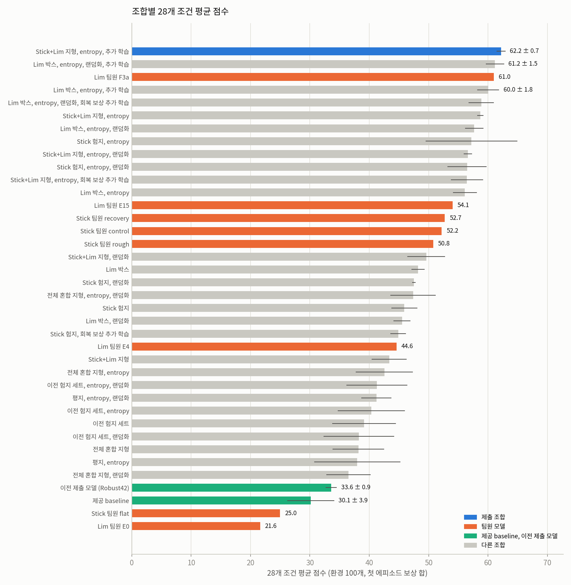
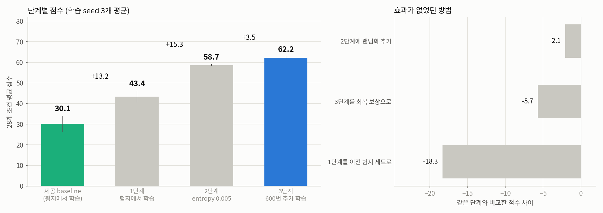
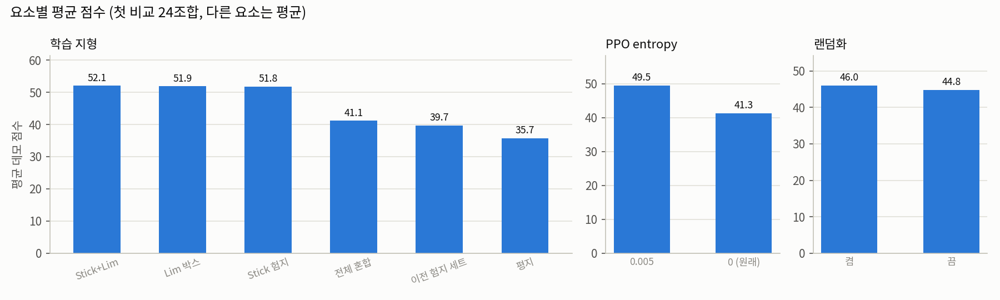
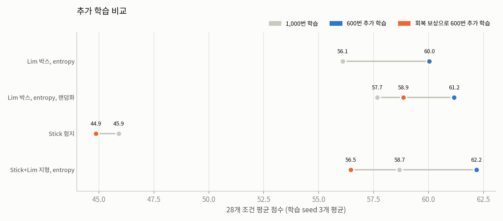
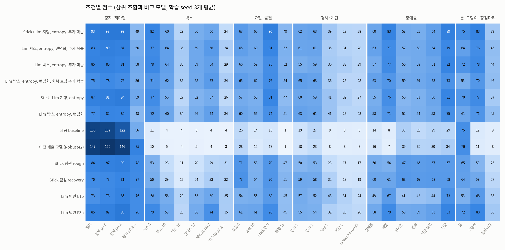
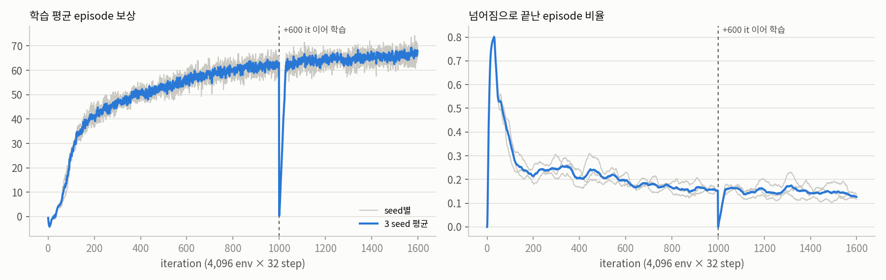
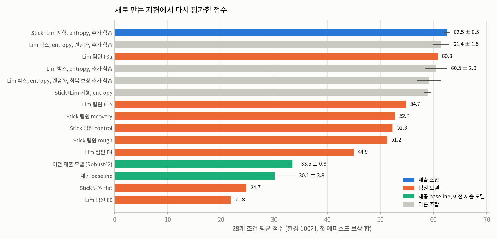
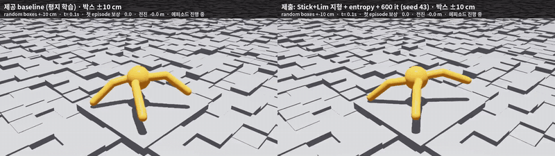
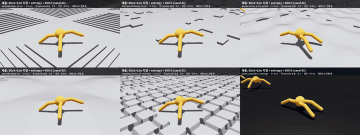

# 팀원 방법 조합 실험 상세 결과

여러 지형에서 점수가 가장 높았던 조합은 Stick+Lim 지형에서 학습하고, PPO entropy 계수를 0.005로 두고, 원래 보상으로 600번 더 학습한 조합이었습니다.
학습 seed 세 개의 평균이 62.2점으로, 같은 기준에서 제공 baseline은 30.1점, 이전 제출 모델(Robust42)은 33.6점, 팀원 모델 중 가장 높았던 Lim 팀원 F3a는 61.0점이었습니다.
제출 모델은 이 조합의 seed 43(62.8점)입니다. 아무도 학습에 쓰지 않은 지형만 보면 1위와 F3a, 2위 조합의 차이는 0.5점 정도라 비슷한 수준입니다.
고른 뒤 새로 만든 지형에서 다시 평가해도(1위 62.5, 2위 61.4, F3a 60.8) 수업 평가 스크립트처럼 모델마다 따로 실행해도(1위 62.1, 2위 61.2, F3a 60.9) 순위는 같았습니다.

[README 요약](../README.md) · [사전 계획](experiment_plans/combo_v28.md) · [결과 표·원자료](../artifacts/combo_v28/)

## 1. 비교한 방법

### 팀원 결과에서 가져온 방법

| 요소 | 팀원 저장소에서 확인한 효과 | v28에서의 구현 |
|---|---|---|
| 발밑 기준 높이 관측·넘어짐 판정 | Stick·Lim 모두 사용. Lim: 높이 관측만 바꿔도 처음 보는 지형 +6.4 (E3→E4) | 몸통 위 20 m에서 아래로 ray 1개. 모든 v28 학습·평가 공통(평지에서는 원래와 동일) |
| Stick 험지 | 평지 모델 대비 16초 생존 16% → 91% | 요철 ±5 cm 50%, 물결 5–15 cm 30%, 완경사 0.05–0.15 오르막·내리막 각 10% |
| Stick 회복 보상(이어 학습) | 같은 부모·600 it에서 생존 90.5% → 95.0%, 낙상 −47%, 속도 −4% | 넘어짐 −10, 몸체 여유(0.48 m)·기울기 위험 −2, 전진 4.5 m/s 상한, 행동 변화 −0.01, roll/pitch 각속도 −0.025 |
| Lim 박스 지형 | 박스 ±10 cm만 학습(V3)이 7종 혼합(E4)보다 +8.3 | 0.45 m 격자 박스 ±10 cm만 |
| Lim entropy | entropy 0 → 0.005: 혼합 지형 +3.7, 박스 지형 +11.5 | PPO entropy 0.005 |
| Lim 학습량 | E15 + 600 it(F3a)이 +5.3 | 1000 it 뒤 +600 it 이어 학습(가중치만 불러오고 optimizer 새로) |

출처: [Stick-0/isaac-ant-rough-terrain@3cc718a](https://github.com/Stick-0/isaac-ant-rough-terrain/tree/3cc718a4214f336fd4db7db5841fa86033b99d35),
[LimDaeKyung/IsaacLab_RS@8d9eed1](https://github.com/LimDaeKyung/IsaacLab_RS/tree/8d9eed1fe463f638d5a62528dbcc0a3656ddd52b) (BSD-3-Clause).
수치는 각 팀원이 자기 평가 환경에서 보고한 값이며, 아래 v28 평가와 직접 비교하는 숫자가 아닙니다.

### 이전 제출 모델에서 가져온 방법

| 방법 | 이전 결과 | 이번 실험에서의 설정 |
|---|---|---|
| Robust42 랜덤화 | 평지 OOD 3종 평균 return +14.3% (저마찰 +21.6%) | 마찰 0.45–1.35, 몸통 질량 ×0.8–1.2, COM ±2.5 cm, reset 자세·속도 교란, 4–8초마다 ±0.35 m/s push, 관측 노이즈 |
| 이전 험지 세트 | 91D 연구 정책의 학습 지형 | 요철 2–12 cm, 경사 0.05–0.45 오르막·내리막, 계단 3–15 cm 오르막·내리막, 물결, 장애물 4–22 cm, 징검다리, 평지(각 1/9) |

91D 관측(발디딤·FK·높이 명령)·교사 prior·이력 gate는 조교의 60D 데모 평가에 넣을 수 없어 v28에서 제외했습니다.

## 2. 평가 방법

- 과제 안내: 조교가 공개하지 않은 "처음 보는 환경"에서 `play_one_episode.py`를 `num_envs=100`으로 실행하고,
  환경별 첫 episode 누적 보상의 평균·표준편차를 점수로 씁니다(Week03 PDF p.39–42).
- v28은 제출 Play 환경 `Week03-Ant-Combo-v28-Play`에서 **지형만** 바꿔 같은 규칙으로 평가합니다:
  100 env, 평가 seed 24, 원래 7개 보상 항, 16초.
- 한 프로세스에서 여러 체크포인트를 평가할 때도 공식 스크립트의 첫 reset 상태를 그대로 재현합니다.
  [공식 스크립트 사본](../scripts/play_one_episode_official.py)과 [v28 평가기](../scripts/evaluate_demo_v28.py)의 결과가
  박스 ±10 cm에서 baseline42 **4.267905 ± 3.614654**, Lim F3a **59.476919 ± 14.229262**로 소수점 6자리까지 같습니다
  (F3a는 본 평가에서 같은 프로세스의 36번째 체크포인트였습니다). [대조 기록](../artifacts/combo_v28/results/official_parity.json)
- 평가는 결정적입니다: 같은 체크포인트 순서로 다시 실행하면 환경별 return이 모두 같습니다. 다만 같은 프로세스에서 앞서 평가한
  체크포인트의 영향이 **피라미드 계단이 있는 두 조건(계단 10 cm, Isaac Lab rough)**에서 남습니다. 공식 스크립트처럼 체크포인트마다
  새 프로세스로 평가한 결과는 [5절](#5-수업-평가-스크립트-방식으로-다시-확인)에 있고, 순위는 같습니다.
  처음 기록한 일치 값(4.962261·59.442660)은 2026-10-02 20:26 지형 생성기 수정 **전** 박스 지형의 값이라 위 값으로 대체합니다.
- 지형 28조건은 학습 결과를 보기 전에 고정했습니다(사전 계획 참고). 모든 로봇이 160 m strip의 첫 줄에서 출발합니다.
  **데모 점수 = 28조건 평균 return**입니다.

## 3. 결과 (처음 정한 평가 지형)

총 98개 체크포인트(새 v28 학습 84개 + 제공 baseline·Robust42 6개 + 팀원 원본 8개) × 28조건 = 2,744회 평가(각 100 env 첫 episode).
`±`는 학습 seed 3개의 표본 표준편차입니다. [전체 순위 표](../artifacts/combo_v28/results/tables.md) ·
[조합별 CSV](../artifacts/combo_v28/results/selection_recipes.csv) · [체크포인트별 CSV](../artifacts/combo_v28/results/selection_checkpoints.csv) ·
[조건별 CSV](../artifacts/combo_v28/results/selection_conditions.csv) · [원시 결과(환경별 return 포함)](../artifacts/combo_v28/results/selection_evaluations.jsonl.gz)

| 순위 | 조합 | 데모 점수 | 범주 균형 | 학습 지형 밖 | 넘어짐률 | 박스 ±10 cm | 평지 |
|---:|---|---:|---:|---:|---:|---:|---:|
| 1 | **Stick+Lim 지형 + entropy · +600 it** | **62.2 ± 0.7** | **63.4** | **59.9** | 22% | 60.1 | 93.1 |
| 2 | Lim 박스 + entropy + 랜덤화 · +600 it | 61.2 ± 1.5 | 61.9 | 59.4 | 15% | 63.9 | 83.3 |
| – | Lim F3a (팀원 원본, 1,600 it) | 61.0 | 62.0 | 59.5 | 18% | 59.5 | 84.9 |
| 3 | Lim 박스 + entropy · +600 it | 60.0 ± 1.8 | 61.0 | 58.3 | 22% | 63.9 | 84.5 |
| 4 | Lim 박스 + entropy + 랜덤화 · +600 it 회복 보상 | 58.9 ± 2.1 | 59.3 | 57.4 | 8% | 62.4 | 75.0 |
| 5 | Stick+Lim 지형 + entropy (1단계) | 58.7 ± 0.5 | 59.9 | 56.7 | 25% | 56.5 | 87.0 |
| 6 | Lim 박스 + entropy + 랜덤화 (1단계) | 57.7 ± 1.5 | 58.3 | 56.1 | 15% | 60.3 | 76.6 |
| 7 | Stick 험지 + entropy (1단계) | 57.2 ± 7.7 | 59.1 | 55.3 | 32% | 41.9 | 90.5 |
| – | Stick recovery (팀원 원본) | 52.7 | 54.0 | 52.0 | 16% | 29.1 | 76.4 |
| … | 이전 제출 모델 Robust42 (평지) | 33.6 ± 0.9 | 37.4 | 30.9 | 39% | 4.8 | 146.6 |
| … | 제공 baseline (평지) | 30.1 ± 3.9 | 33.5 | 27.4 | 48% | 4.2 | 138.4 |

"학습 지형 밖"은 누군가의 학습 지형과 같은 3조건(평지, 박스 ±10 cm, Stick 험지)을 뺀 25조건 평균입니다.



### 단계별 개선 과정

제공 baseline에서 제출 조합까지 바꾼 것을 한 단계씩 쌓은 결과입니다. 단계마다 실제로 학습(seed 3개)·평가한 조합이며,
세 단계 모두 seed 3개 전부에서 점수가 올랐습니다.

| 단계 | 바꾼 것 | 조합 | 28조건 평균 | 증가 (seed 승) | 박스 ±10 cm | 평지 | 넘어짐률 |
|---|---|---|---:|---:|---:|---:|---:|
| 출발 | 제공 baseline (평지 학습) | `flat_e0_d0` | 30.1 | | 4.2 | 138.4 | 48% |
| ① | 학습 지형 → Stick 험지 + Lim 박스 반반 (발밑 지면 높이 관측) | `sticklim_e0_d0` | 43.4 | +13.2 (3/3) | 40.9 | 70.6 | 45% |
| ② | PPO entropy 0 → 0.005 | `sticklim_e5_d0` | 58.7 | +15.3 (3/3) | 56.5 | 87.0 | 25% |
| ③ | 원래 보상으로 +600 it 이어 학습 | `sticklim_e5_d0+stock` | 62.2 | +3.5 (3/3) | 60.1 | 93.1 | 22% |

같은 지점에서 다른 선택을 하면: ① 대신 이전 험지 세트 −18.3(0/3), 전체 혼합 지형 −16.1, ②에 랜덤화 추가 −2.1(0/3),
③을 회복 보상으로 −5.7(0/3, 넘어짐 22% → 16%). 단계 크기는 쌓는 순서에 따라 달라질 수 있습니다.



### 요소별 효과 (한 요소만 바꾼 비교)

같은 지형·랜덤화·seed에서 한 요소만 바꾼 차이입니다(1단계, 같은 예산).

| 요소 | 평균 차이 | 좋아진 조합 | seed 짝 승 | 범주별로 보면 |
|---|---:|---:|---:|---|
| Lim entropy 0 → 0.005 | **+8.1** | 12/12 | 32/36 | 모든 범주에서 +5.5 ~ +11.1 (장애물이 가장 큼) |
| 랜덤화 끔 → 켬 | +1.1 | 7/12 | 17/36 | 평지·저마찰 +4.5, 나머지 범주 −1.2 ~ +1.9 |
| 학습 지형: 평지 → Stick·Lim·Stick+Lim | **+16** | 12/12 | 36/36 | 세 지형끼리는 ±0.3으로 구분되지 않음 |
| 학습 지형: 이전 험지 세트 → Stick·Lim·Stick+Lim | +12 | 12/12 | 36/36 | 이전 험지 세트와 전체 혼합은 평지보다 +4~5에 그침 |



- **entropy**는 지형·랜덤화와 상관없이 일관되게 좋아졌습니다. 1,000 it 예산에서 탐색을 유지한 효과로 보입니다(추정).
- **팀원 지형 셋은 서로 비슷하고 평지·이전 험지 세트보다 훨씬 좋았습니다.** 이전 험지 세트(9종, 장애물 22 cm·계단 15 cm·경사 0.45까지)은
  평지보다 +4에 그쳤습니다. 학습 끝의 넘어짐 비율은 Stick+Lim 지형과 비슷해(0.18–0.31 vs 0.16–0.32) "너무 어려워서"로는 설명되지 않고,
  원인은 따로 검증하지 않았습니다.
- **랜덤화는 평지·저마찰에서만 도움**이 되었고(Robust42 때의 결론과 같음) 험지 점수에는 일관된 효과가 없어, 최종 조합에는 들어가지 않았습니다.

### 600번 추가 학습

| 부모 (1단계) | 1단계 | +600 it 원래 보상 | +600 it Stick 회복 보상 | 넘어짐률 (부모 → 원래 → 회복) |
|---|---:|---:|---:|---|
| Stick+Lim 지형 + entropy | 58.7 | **62.2 (+3.5)** | 56.5 (−2.2) | 25% → 22% → 16% |
| Lim 박스 + entropy + 랜덤화 | 57.7 | **61.2 (+3.5)** | 58.9 (+1.2) | 15% → 15% → 8% |
| Lim 박스 + entropy (Lim 단독) | 56.1 | **60.0 (+3.9)** | – | 24% → 22% |
| Stick 험지 (Stick 단독) | 45.9 | – | 44.9 (−1.0) | 35% → 29% |



- 원래 보상으로 600 it 더 학습하면 세 부모 모두 +3.5 ~ +3.9 올랐습니다(Lim F3a의 "학습량 증가"와 같은 방향).
- Stick 회복 보상은 **넘어짐을 크게 줄였지만**(예: 15% → 8%) 더 조심스럽게 걸어 return(데모 점수)은 원래 보상 이어 학습보다 낮았습니다.
  Stick이 보고한 trade-off(낙상 −47%, 속도 −4%)와 같은 방향입니다. 넘어짐을 최우선으로 본다면 회복 보상이 맞는 선택일 수 있습니다.
- 2단계는 학습량이 1단계의 1.6배라 1단계 조합과 같은 예산 비교가 아닙니다. 2단계 안의 비교(원래 vs 회복 보상)는 같은 예산입니다.

### 지형 종류별 결과

| 조합 | 평지·저마찰 | 박스 | 요철·물결 | 경사·계단 | 장애물 | 틈·구덩이·징검다리 |
|---|---:|---:|---:|---:|---:|---:|
| **Stick+Lim 지형 + entropy · +600 it** | 84.7 | 51.8 | **66.7** | **43.9** | **68.2** | **65.5** |
| Lim 박스 + entropy + 랜덤화 · +600 it | 78.7 | **56.4** | 64.8 | 43.2 | 66.5 | 61.9 |
| Lim F3a (팀원 원본) | **86.7** | 55.2 | 60.8 | 39.3 | 66.7 | 63.3 |
| 이전 제출 모델 Robust42 (평지) | 134.4 | 5.3 | 14.4 | 12.9 | 25.5 | 31.7 |
| 제공 baseline (평지) | 113.3 | 5.2 | 14.1 | 13.9 | 23.0 | 31.7 |



- **trade-off — 평지 속도:** 제출 체크포인트(seed 43)는 평지에서 16초 동안 94 m를 가서 return 92.8입니다.
  제공 baseline seed42는 145 m·140.1, Robust42는 169 m·155.3입니다. 험지를 배운 정책은 평지에서 느리고 조심스럽게 걷습니다.
- **약점 — 매우 미끄러운 지면:** 유효 마찰 0.2(multiply)에서 제출 체크포인트는 평지 41.4·박스 25.6으로, 평지는 Robust42(73.0)·F3a(75.8)보다,
  박스는 F3a(34.6)보다 낮습니다. 최종 조합에는 마찰 랜덤화가 없습니다(랜덤화를 켠 조합은 전체 점수에서 밀렸습니다).
- 제출 조합(3 seed 평균)이 가장 낮은 조건은 미끄러운 박스(24.0), Isaac Lab 표준 rough(27.7), 계단 내리막(28.3), 박스 ±15 cm(29.0)이며
  상위 조합들도 대체로 같은 조건에서 낮았습니다.

### 학습 곡선



1,000 it 지점의 순간 하락은 이어 학습 run이 새로 시작하면서 통계가 초기화되고 episode 길이를 무작위로 시작한 기록상 현상이며 성능 하락이 아닙니다.
[run별 곡선 CSV·설정·체크포인트](../artifacts/combo_v28/runs/)

## 4. 새 지형에서 다시 평가

선택이 끝난 뒤, 2단계 결과를 보기 전에 [고정한 대상](experiment_plans/combo_v28.md#추가-기록)(v28 상위 5조합 × seed 3개, 제공 baseline·Robust42 seed 42–44,
팀원 원본 8개 = 29개 체크포인트)을 28조건 모두 새 지형 seed 2029로 다시 평가했습니다(812회). 이 결과는 선택에 쓰지 않았습니다.
평지·저마찰 4조건은 지형 생성이 없어 두 seed에서 값이 같습니다.

| 확인 순위 | 조합 | seed 2029 | seed 2028 (선택) | 학습 지형 밖 (2029) | 넘어짐률 | 박스 ±10 cm |
|---:|---|---:|---:|---:|---:|---:|
| 1 | **Stick+Lim 지형 + entropy · +600 it** | **62.5 ± 0.5** | 62.2 ± 0.7 | **60.2** | 23% | 59.7 |
| 2 | Lim 박스 + entropy + 랜덤화 · +600 it | 61.4 ± 1.5 | 61.2 ± 1.5 | 59.8 | 15% | 62.0 |
| – | Lim F3a (팀원 원본) | 60.8 | 61.0 | 59.3 | 19% | 57.5 |
| 3 | Lim 박스 + entropy · +600 it | 60.5 ± 2.0 | 60.0 ± 1.8 | 58.7 | 22% | 63.7 |
| 4 | Lim 박스 + entropy + 랜덤화 · +600 it 회복 보상 | 59.1 ± 2.2 | 58.9 ± 2.1 | 57.6 | 8% | 62.5 |
| 5 | Stick+Lim 지형 + entropy (1단계) | 58.9 ± 0.6 | 58.7 ± 0.5 | 57.0 | 24% | 56.0 |
| – | 이전 제출 모델 Robust42 | 33.5 ± 0.8 | 33.6 ± 0.9 | 30.9 | 40% | 4.8 |
| – | 제공 baseline | 30.1 ± 3.8 | 30.1 ± 3.9 | 27.4 | 49% | 4.6 |

제출 체크포인트(seed 43)는 확인 평가에서 63.0(seed 42: 62.3, seed 44: 62.1)입니다.



[확인 평가 순위 CSV](../artifacts/combo_v28/results/confirmation_recipes.csv) · [체크포인트별](../artifacts/combo_v28/results/confirmation_checkpoints.csv) ·
[조건별](../artifacts/combo_v28/results/confirmation_conditions.csv) · [원시 결과](../artifacts/combo_v28/results/confirmation_evaluations.jsonl.gz)

## 5. 수업 평가 스크립트 방식으로 다시 확인

v28 평가기는 한 프로세스에서 여러 체크포인트를 차례로 평가합니다. 공식 `play_one_episode.py`는 체크포인트마다 새 프로세스를 씁니다.
제출 seed 43을 조건마다 새 프로세스로 평가했더니 계단 10 cm가 40.21(본 평가 44.75)로 달라, 결과를 보기 전에 [점검 범위를 기록](experiment_plans/combo_v28.md#추가-기록)하고
1·2위 조합(seed 3개씩)과 Lim F3a는 28조건 전부, 3–5위 조합은 계단 계열 3조건을 새 프로세스로 다시 평가했습니다(총 223건).

| 조합 | 본 평가 | 공식 방식 | 비고 |
|---|---:|---:|---|
| **Stick+Lim 지형 + entropy · +600 it** | 62.18 | **62.08** | 28조건 전부 새 프로세스 (seed 42 62.25 · **43 62.61** · 44 61.37) |
| Lim 박스 + entropy + 랜덤화 · +600 it | 61.17 | 61.16 | 28조건 전부 |
| Lim F3a (팀원 원본) | 60.96 | 60.91 | 28조건 전부 |
| Lim 박스 + entropy · +600 it | 60.03 | 60.02 | 계단 계열 3조건만 새 프로세스 |
| Lim 박스 + entropy + 랜덤화 · +600 it 회복 보상 | 58.85 | 58.78 | 계단 계열 3조건만 |
| Stick+Lim 지형 + entropy (1단계) | 58.68 | 58.58 | 계단 계열 3조건만 |

- 28조건 전부를 다시 평가한 7개 체크포인트는 **26/28 조건에서 환경별 return까지 같았습니다.** 다른 조건은 계단 10 cm(16개 중 15개, 차이 −4.5 ~ +2.8)와
  Isaac Lab rough(15/16, −0.6 ~ +1.0)뿐이고, 둘 다 피라미드 계단이 있습니다. 역피라미드 계단(내리막)은 16/16 같았습니다.
  같은 결과가 나온 1개는 본 평가에서 프로세스의 첫 번째로 평가된 체크포인트였습니다.
- 원인은 확인하지 않았습니다. 평가기는 매번 같은 난수·관절 상태로 reset하지만, 앞선 rollout이 남긴 물리 엔진 내부 상태(접촉 캐시 등)가 계단 접촉에 영향을 주는 것으로 추정합니다.
- **순위와 제출 선택은 바뀌지 않습니다.** 조교가 공식 스크립트로 받을 값은 공식 방식 열과 같은 방식입니다.

[점검 결과](../artifacts/combo_v28/results/fresh_process_check.json) · [조건별 비교](../artifacts/combo_v28/results/fresh_process_conditions.csv) ·
[점검 스크립트](../scripts/fresh_check_v28.py)

## 6. 영상

미리 정한 지형(박스 ±10 cm 비교 + 6개 지형)에서 16 env 배치의 env 0을 16초 전체 녹화했습니다(지형 seed 2028, 평가 seed 24, 30 fps).
첫 episode가 끝나면 로봇이 자동 reset되며 화면 글자는 첫 episode 값을 유지합니다. 배치 크기가 달라 100 env 평가와 초기 상태가 다릅니다.

| 영상 | 모델 | 첫 episode 보상 (env 0) | 결과 |
|---|---|---:|---|
| 박스 ±10 cm | 제공 baseline seed42 | 4.3 | 3.6초에 넘어짐 |
| 박스 ±10 cm | 제출 (seed 43) | 61.3 | 16초 완주 |
| 계단 10 cm | 제출 | 37.2 | 16초 완주 |
| 장애물 10 cm | 제출 | 63.2 | 16초 완주 |
| 물결 15 cm | 제출 | 58.2 | 16초 완주 |
| 경사 0.2 | 제출 | 4.7 | **1.9초에 넘어짐** (100 env 넘어짐률 32%) |
| 징검다리 | 제출 | 62.4 | 16초 완주 |
| 평지 μ0.1 | 제출 | 106.0 | 16초 완주 |

[](../artifacts/combo_v28/media/boxes_10_baseline_vs_submission.mp4)

[](../artifacts/combo_v28/media/submission_six_terrains.mp4)

[영상별 조건·체크포인트/영상 SHA](../artifacts/combo_v28/media/manifest.json)

## 한계

- 최종 조합은 **두 팀원의 요소(Stick+Lim 학습 지형, Lim의 entropy·추가 학습)를 합친 것**입니다. 이 실험의 몫은 같은 예산에서 방법들을 하나씩, 또 섞어서 비교하고 28개 조건으로 평가한 것이고, 이전 제출 모델(Robust42)의 랜덤화는 저마찰에서만 효과가 있어 최종 조합에서 빠졌습니다.
- 1위와 팀원 원본 F3a의 차이(1.2)는 seed 간 표준편차(0.7)의 두 배 정도이고, 학습 지형 밖 조건만 보면 0.5입니다.
  F3a는 체크포인트 1개(Lim이 고른 seed 47)라 seed 분포를 알 수 없습니다. "확실히 더 좋다"보다는 "같은 수준이거나 조금 높다"가 정확합니다.
- 평가 지형 28조건은 우리가 고른 것이고, 조교의 실제 평가 지형은 공개되지 않았습니다. 지형에 따라 순위가 바뀔 수 있어
  범주별·조건별 표를 함께 공개합니다.
- 제출 정책은 발밑 지면 높이(ray 1개)를 관측합니다. 원래 `Isaac-Ant-v0`처럼 월드 z를 높이로 넣으면 울퉁불퉁한 지형에서 관측 의미가 달라지므로
  `Week03-Ant-Combo-v28-Play` task로 평가해야 합니다(평지에서는 두 값이 같음).
- 모든 결과는 시뮬레이션(Isaac Sim 5.1, PhysX GPU)이며 학습 seed는 조합당 3개입니다.

## 재현

```bash
export ROBOTICS_SIM_CLASS_ROOT=/mnt/ssd970/robotics_simulation_class
source "$ROBOTICS_SIM_CLASS_ROOT/activate.sh"
python -m pip install --no-deps -e .

# 1단계 한 조합 예: Stick+Lim 지형 + entropy, seed 43
python scripts/train_combo_v28.py --task Week03-Ant-Combo-v28-Sticklim-D0-Stock --seed 43 \
  --num_envs 4096 --max_iterations 1000 --run_name v28s1_sticklim_e5_d0_s43 --headless \
  agent.algorithm.entropy_coef=0.005

# 실제로 실행한 전체 큐 (완료된 작업은 건너뜀)
python scripts/run_combo_v28.py --phase stage1
python scripts/run_combo_v28.py --phase eval
python scripts/run_combo_v28.py --phase stage2 --jobs sticklim_e5_d0+stock sticklim_e5_d0+recovery \
  lim_e5_d1+stock lim_e5_d1+recovery stick_e0_d0+recovery lim_e5_d0+stock
python scripts/run_combo_v28.py --phase eval
python scripts/run_combo_v28.py --phase confirm --ids \
  sticklim_e5_d0+stock_s{42,43,44} lim_e5_d1+stock_s{42,43,44} lim_e5_d0+stock_s{42,43,44} \
  lim_e5_d1+recovery_s{42,43,44} sticklim_e5_d0_s{42,43,44} flat_e0_d0_s{42,43,44} flat_e0_d1_s{42,43,44} \
  ref_stick_flat ref_stick_rough ref_stick_control ref_stick_recovery ref_lim_e0 ref_lim_e4 ref_lim_e15 ref_lim_f3a
python scripts/summarize_combo_v28.py --plots
python scripts/publish_combo_v28.py --runs v28s1_sticklim_e5_d0_s{42,43,44} "v28s2_sticklim_e5_d0+stock_s"{42,43,44} \
  --submission "v28s2_sticklim_e5_d0+stock_s43" --plot --media
python -m pytest -q tests/test_combo_v28.py
```

팀원 체크포인트(`ref_*`)는 각 팀원 저장소에서 받아 `outputs/combo_v28/references/`에 두며, SHA는 `scripts/run_combo_v28.py`에 고정했습니다.
이 PC에서는 RTX 5070을 쓰도록 `--device cuda:1 --kit_args="--/renderer/multiGpu/enabled=false"`를 붙였습니다.
