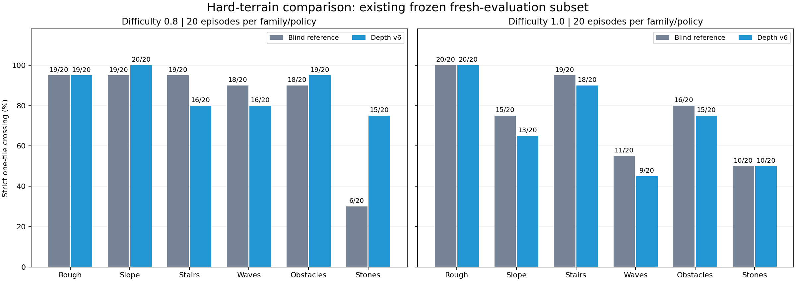
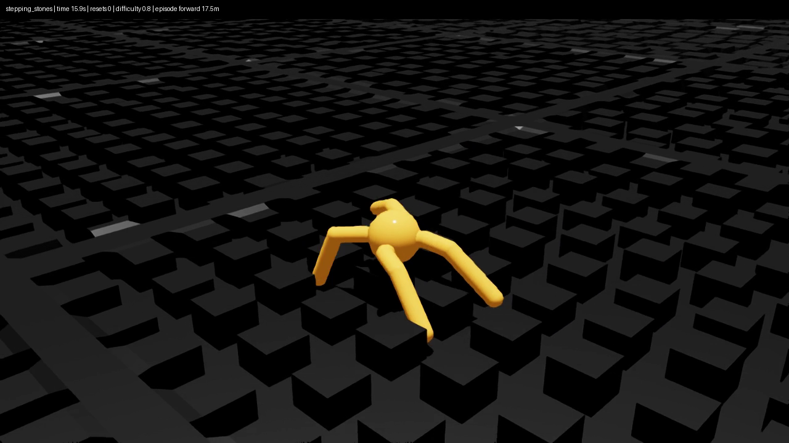
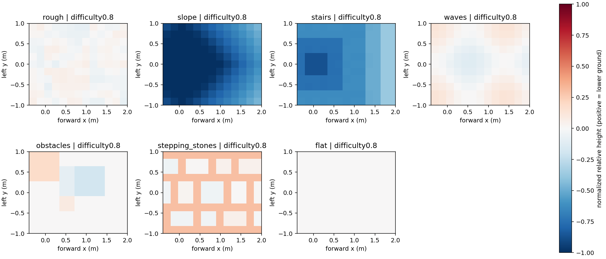

# v6: terrain-depth observations and training

The user requested terrain-depth perception after the remaining high-stone
failures of [the 60D recovery policy](ROUGH_RECOVERY.md). This is a **separate
346D policy**, not a replacement for the original 60D course submission.
All v0–v5 checkpoints and task definitions are retained.

## What the sensor is (and is not)

The first implementation is a local **raycast depth/height map**, not an RGB-D
image rendered through a physical camera. A yaw-stabilized 13×11 downward-ray
grid samples a 2.4×2.0 m footprint at 0.2 m spacing. The centre is 0.8 m forward
of the torso, covering x=−0.4…2.0 m and y=−1.0…1.0 m in the yaw frame. Rays
start 2 m above the torso and have a 4 m maximum range.

- The original 60 proprioceptive features are unchanged and first in the vector.
- 143 values encode `clip(root_z - hit_z - 0.5, -1, 1)`.
- 143 validity bits distinguish real returns from missing/invalid measurements.
- A miss is height +1 with validity 0, not a fictitious safe flat patch.
- Training perturbs valid heights by up to 0.02 m; evaluation is noise-free.
- No lane family, difficulty, global map or future trajectory enters the actor.
- Actions remain 8D effort commands with scale 7.5; hidden layers remain
  `[400, 200, 100]`. New input columns are initialized to zero to retain the old
  deterministic policy before learning.

Isaac Lab's RayCaster accepts one static mesh. The v5 scene also contains a
separate infinite ground plane at z=−50 m. For **every** downward ray, the
encoder takes the nearest valid surface among the actual mesh return and the
analytic intersection with that existing plane, rejecting out-of-range hits.
It does not choose sensor values using lane/family identity. This prevents the
flat family from receiving all-missing scans while leaving collision geometry
unchanged.

The configuration uses `clone_in_fabric=False` for materialized sensor views
and explicitly recomputes the scan at observation time after lane-wrap events.
This is idealized terrain perception: static geometry, yaw stabilization, no
camera lens model, no RGB, and no robot-body occlusion. A rendered depth camera
or real-world deployment would need separate validation.

Official API context (installed Isaac Lab 2.3 / Isaac Sim 5.1):
[RayCaster](https://isaac-sim.github.io/IsaacLab/v2.3.0/source/overview/core-concepts/sensors/ray_caster.html),
[grid patterns](https://isaac-sim.github.io/IsaacLab/v2.3.0/_modules/isaaclab/sensors/ray_caster/patterns/patterns_cfg.html).
The implementation was also checked against the installed source and simulator,
not just documentation from a different release.

## Validation before training

- 59 CPU tests: depth bounds/misses/plane geometry/translation invariance plus
  checkpoint expansion and existing strict traversal regression coverage.
- 64-environment, two-iteration PPO smoke: passed with finite 346D observations.
- 35-environment sensor probe (one per family/difficulty): 143 rays, reachable
  flat-plane returns, visible stone gaps, fresh teleport/reset observations and
  exact scan equivalence after a full lane wrap (maximum error 0).
- Actual old/expanded checkpoint action comparison: maximum numerical error 0
  on the fixed CPU test samples. The source checkpoint hash is unchanged.

The probe's artificial first-tile placements are sensor diagnostics, not
successful traversal episodes.

## Fair comparison

The terrain generator, episode duration, actions, first 60 observations and
strict one-/six-tile success rules match v5. Only separate v6 tasks add the
sensor. Sensor initialization/reset RNG and materialized cloning can change
initial samples under the same numeric seed. Therefore the paired **blind
reference** is the frozen, zero-expanded old policy in the **same v6 scene**,
where all extra input weights are zero. Historical v5 counts are context, not
claimed bit-identical paired rollouts.

At reset 24 / generator 51 / 175 environments, this blind reference has
126/150 strict terrain successes, 15/25 stone successes, 17 terrain falls and
62/150 six-tile successes. It receives the scan but mathematically ignores it.

Evaluation supports explicit `--depth-mode zero` and `--depth-mode shuffle`
ablations, with mode and sensor metadata saved in JSON. These change only the
new 286 features, not proprioception or the benchmark. Nonzero learned input
weights alone are not proof that useful terrain information is being used.

Model selection uses reset 24. Fresh post-selection tests are reserved at
reset seeds 31/32 and geometry seeds 56/57 (reset 33), paired with the blind
reference. No claim of a depth-only causal gain will be made without a matched
training control; ablations establish dependence, not that entire causal claim.

## Training / results

Full PPO training completed: 4,096 environments × 32 steps × 1,500 iterations
= **196,608,000 transitions**, seed 42, approximately 14 minutes on GPU0.
The 500/1,000/1,499 checkpoints were compared on reset 24 / geometry 51;
the final checkpoint was frozen before fresh validation. No additional
stabilization or actor-rehearsal training was performed.

| Candidate | Strict one-tile / 150 | Stones / 25 | Terrain falls / 150 | Six-tile / 150 |
|---|---:|---:|---:|---:|
| Frozen blind reference | 126 | 15 | 17 | 62 |
| Depth iteration 500 | 102 | 17 | 22 | 47 |
| Depth iteration 1,000 | 125 | 17 | 19 | 14 |
| **Depth iteration 1,499** | **135** | **22** | **12** | **28** |

This is **selection-set evidence**, not the fresh validation result. The depth
policy improves the strict one-tile objective here but crosses six consecutive
tiles less often. The fresh results below do **not** justify replacing the
recommended 60D v5 model. The new 346D model does not load into the original
60D course task.

Selected checkpoint:
`artifacts/terrain_demo/runs/depth_v6_recovery1499_seed42/model_1499.pt`.
SHA-256: `c6bc31fe1c18a093348927c101e0979c8c9aa0294a8573d4aa64d7b8b0d44fb7`.
The [selection record](../artifacts/terrain_demo/evaluations/depth_v6/selection_frozen.json)
preserves all candidates, the freeze timestamp and the predeclared validation gate.

### Frozen paired results

Each run scores the first complete episode of 175 environments: 150 terrain
episodes plus 25 flat-plane episodes, 16 seconds maximum. Strict success means
at least **13.1 m** forward travel with no terminal condition, whole-footprint
lane exit or world exit during that episode. Six-tile success requires **53.1 m**
under the same conditions. Survival or distance-only clearance is not success.

| Set / policy | Strict one-tile | Six-tile | Terrain falls | Stones | Lane exits | Flat falls |
|---|---:|---:|---:|---:|---:|---:|
| Fixed 24/25/26: blind | 386/450 | 201/450 | 45 | 49/75 | 2 | 2/75 |
| Fixed 24/25/26: depth | 401/450 | 84/450 | 34 | 61/75 | 9 | 3/75 |
| **Fresh: blind** | **524/600** | **274/600** | **46** | **62/100** | **5** | **11/100** |
| **Fresh: depth** | **521/600** | **119/600** | **62** | **79/100** | **8** | **10/100** |

Fresh means generator/reset pairs **51/31, 51/32, 56/33, 57/33**, withheld until
the checkpoint was frozen. All runs have zero world exits. On this set, terrain
speed decreases from 3.027 to 2.633 m/s. The predeclared aggregate gate
(more strict successes, no more terrain falls, zero world exits) **FAILS**.
No policy was retrained or reselected after seeing these results.

Fresh per-family results (100 episodes per family):

| Family | Blind → depth strict success | Blind → depth falls |
|---|---:|---:|
| Rough | 96 → 96 | 4 → 4 |
| Slope | 91 → 87 | 9 → 12 |
| Stairs | 95 → 89 | 5 → 10 |
| Waves | 86 → 78 | 13 → 21 |
| Obstacles | 94 → 92 | 5 → 7 |
| **Stepping stones** | **62 → 79** | **10 → 8** |

Stone successes by difficulty 0.2/0.4/0.6/0.8/1.0, each out of 20:
**18/20, 20/20, 8/20, 6/20, 10/20 → 18/20, 20/20, 16/20, 15/20, 10/20**.
However, six-tile stone successes decrease from **2/100 to 0/100**: improved
first-obstacle traversal has not solved sustained stone traversal.

Decision: retain the depth model as an **experimental depth-aware checkpoint**,
not the overall recommended replacement. Keep the previous v5 recommendation.
One training seed and these finite simulator tests do not establish arbitrary
terrain generalization or real-robot safety. The sensor is still idealized.

### Hard-level comparison: difficulties 0.8 and 1.0

On the user's subsequent request, the same four frozen fresh pairs were split
by their two hardest configured levels. This is a **subgroup of existing data**,
not new independent rollouts, retraining or checkpoint selection. Each
family/level has 20 episodes per policy, totaling 240 hard-terrain episodes per
policy. Level1.0 is the maximum of the current v6 terrain configuration, not a
claim about arbitrary harder geometry or the older v4 pit/gap tasks.

| Difficulty | Blind → depth strict one-tile | Blind → depth falls | Blind → depth six-tile |
|---|---:|---:|---:|
| 0.8 | 99/120 → 105/120 | 12 → 10 | 22 → 1 |
| 1.0 | 91/120 → 85/120 | 19 → 28 | 3 → 0 |
| Combined | 190/240 → 190/240 | 31 → 38 | 25 → 1 |

| Family | Difficulty0.8 blind → depth /20 | Difficulty1.0 blind → depth /20 |
|---|---:|---:|
| Rough | 19 → 19 | 20 → 20 |
| Slope | 19 → 20 | 15 → 13 |
| Stairs | 19 → 16 | 19 → 18 |
| Waves | 18 → 16 | 11 → 9 |
| Obstacles | 18 → 19 | 16 → 15 |
| Stepping stones | 6 → 15 | 10 → 10 |

The improvement at0.8 does **not** persist at the maximum level. In particular,
level1.0 stone success stays50%, with falls increasing1→4/20 and lane exits0→3/20.
The overall recommendation remains unchanged.

[Side-by-side high-difficulty video viewer](../artifacts/terrain_demo/depth_v6_hard/index.html)
compares all six families at **level1.0, generator56/reset33, 16seconds**, using
both frozen policies in the same v6 scene. The families and conditions were
fixed before recording, and unfavorable clips are retained. These qualitative
videos are not added to the numerical benchmark counts.

[Detailed table](../artifacts/terrain_demo/evaluations/depth_v6/hard_terrain_summary.md),
[machine-readable counts and provenance](../artifacts/terrain_demo/evaluations/depth_v6/hard_terrain_summary.json),
and [independent raw-array verification](../artifacts/terrain_demo/evaluations/depth_v6/hard_terrain_verification.json)
are retained. The independent subgroup audit found **zero summary mismatches**.



### Does the policy use depth?

Only the new 286 features are changed; checkpoint, proprioception, scene,
geometry seed51 and reset seed24 remain fixed:

| Input | Strict one-tile / 150 | Stones / 25 | Terrain falls | Lane exits |
|---|---:|---:|---:|---:|
| Actual scan | **135** | **22** | **12** | **2** |
| All depth features zero | 86 | 14 | 33 | 27 |
| Scan rolled between environments | 106 | 14 | 35 | 4 |

This supports **behavioral reliance on the depth input**. It is not a proof
that depth alone caused the stone improvement: there is no equal-budget
blind retraining control. Zeroing also removes validity bits, and cross-environment
shuffling mismatches body-relative heights as well as terrain geometry. Both
are distribution-shift interventions, not realistic sensor-noise experiments.

Machine-readable [summary](../artifacts/terrain_demo/evaluations/depth_v6/summary.json),
[table](../artifacts/terrain_demo/evaluations/depth_v6/summary.md),
[per-family CSV](../artifacts/terrain_demo/evaluations/depth_v6/family_summary.csv),
and all 16 canonical evaluation JSON files are retained in the same directory.

### Replay and evaluate

```bash
CKPT=artifacts/terrain_demo/runs/depth_v6_recovery1499_seed42/model_1499.pt
./scripts/run_evaluate.sh --task Week03-Ant-Depth-Lanes-Eval-v6 \
  --headless --device cuda:0 --num_envs 175 --seed 31 --max_steps 960 \
  --checkpoint "$CKPT" --depth-mode actual --output outputs/depth_replay.json \
  env.scene.terrain.terrain_generator.seed=51 \
  --kit_args=--/renderer/multiGpu/enabled=false

./scripts/run_terrain_demo.sh --task Week03-Ant-Depth-Lanes-Demo-v6 \
  --device cuda:0 --seed 7 --family stepping_stones --level 3 \
  --cycle-seconds 16 --checkpoint "$CKPT" \
  --kit_args=--/renderer/multiGpu/enabled=false
```

For the paired blind run, use
`artifacts/terrain_demo/runs/depth_v6_blind_reference/model_0.pt` in the **same v6 task**.
For ablations change only `--depth-mode` to `zero` or `shuffle` (shuffle needs
at least two environments). To reproduce the sensor check:

```bash
../run-python scripts/probe_depth_sensor.py --headless --device cuda:0 \
  --seed 24 --output outputs/depth_sensor_probe.json \
  --kit_args=--/renderer/multiGpu/enabled=false
```

Run GPU jobs sequentially. The GUI demo command runs until its window closes;
add `--headless --record outputs/depth_demo.mp4` to record one bounded cycle.

### Recorded replay

[Depth policy](../artifacts/terrain_demo/depth_v6_stones08_seed7.mp4) and
[same-scene blind reference](../artifacts/terrain_demo/depth_v6_blind_stones08_seed7.mp4)
are uncut 16-second stepping-stone difficulty0.8 / seed7 replays. Each has
480 frames at 30fps, 1280×720, and passed full video decoding. At the inspected
15.9-second frame, captions report 17.5m for depth versus 14.0m for blind,
both with zero resets. The final frame visibly includes the normal 16-second
timeout reset; it was not edited out.

These are qualitative examples, **not additional benchmark successes**.
[Video hashes and checks](../artifacts/terrain_demo/evaluations/depth_v6/video_validation.json)
record both checkpoints and the inspection details.




## Reproduce the first training run

The expansion utility retains its legacy 54-feature and LR2e-4 defaults for
v3/v4 reproducibility. **Pass all v6 options explicitly**, including the optional
iteration reset. The measured warm start was already at iteration0 because its
source was the actor-rehearsal checkpoint; the reset flag makes that intent
explicit for future sources and records their original iteration.

```bash
../run-python scripts/expand_checkpoint.py \
  artifacts/terrain_demo/runs/rough_v5_portal_rehearsal4_seed43/model_round_4.pt \
  logs/rsl_rl/week03_ant_depth_v6/init_depth_reproduced/model_0.pt \
  --extra-dims 286 --std 0.20 --learning-rate 0.0001 --reset-iteration

./scripts/run_train.sh --task Week03-Ant-Depth-Lanes-Train-v6 \
  --headless --device cuda:0 --num_envs 4096 --max_iterations 1500 --seed 42 \
  --resume --load_run init_depth_reproduced --checkpoint model_0.pt \
  --run_name depth143_reproduced \
  agent.algorithm.schedule=fixed agent.algorithm.learning_rate=0.0001 \
  agent.algorithm.desired_kl=null agent.algorithm.gamma=0.995 \
  agent.algorithm.entropy_coef=0.002 agent.save_interval=250 \
  env.events.lane_layout.params.family_weights.stepping_stones=4.0 \
  env.rewards.fall.weight=-1800.0 env.rewards.stall.weight=-2.0 \
  env.rewards.stone_body_height.weight=-3.0 \
  env.rewards.stone_body_height.params.target_height=0.55 \
  env.rewards.stone_swing_clearance.params.trap_weight=0.0 \
  env.terminations.lane_departure.params.margin=1.1 \
  --kit_args=--/renderer/multiGpu/enabled=false
```

[Sensor probe results](../artifacts/terrain_demo/evaluations/depth_v6/sensor_probe.json)
and [frozen blind reference](../artifacts/terrain_demo/runs/depth_v6_blind_reference/model_0.pt)
are retained separately from the learned policy.



## Implementation and final checks

- New `src/week03_ant/depth_math.py`: bounded, finite mesh/plane depth encoding.
- New `src/week03_ant/tasks/depth_v6_cfg.py`: separate sensor/observation/task
  configs; existing v5 geometry and behavior are reused rather than duplicated.
- Task registrations and `DepthLaneAntPPORunnerCfg`: a separate training namespace.
- `scripts/play_one_episode.py`: explicit depth ablations and sensor metadata;
  unchanged strict traversal classification.
- `scripts/expand_checkpoint.py`: opt-in iteration reset; legacy defaults retained.
  `scripts/stage_run.py` accepts the separate `depth_v6` artifact variant.
- New `scripts/probe_depth_sensor.py`, `tests/test_depth_math.py` and
  `tests/test_expand_checkpoint.py`; no new dependencies or inference controller.

Fresh final checks: **59 CPU tests passed**, Python compilation, shell syntax
and `git diff --check` passed. Simulator sensor probe, PPO smoke, full training,
all evaluation runs and both video decodes completed successfully. Independent
implementation review approved the sensor and compatibility changes. The prior
v5 reference and traverse checkpoint hashes remain unchanged.

The independent [numerical audit](../artifacts/terrain_demo/evaluations/depth_v6/verification.json)
recomputed all **16 canonical rollouts / 2,800 first episodes** (including 350
ablation episodes): checkpoint SHA/finite 346D/8D interface, strict geometry,
terminal/boundary exclusions, family/level counts and summary totals.
Missing/invalid rollouts and summary mismatches are **zero**. Its performance
verdict independently confirms **FAIL / do not promote** on the fresh overall gate.

Ruff, Mypy, Pyright and a Python LSP were unavailable; no claim of those checks
is made. No remote Git/GitHub operation or commit was performed. Training,
evaluation and rendering processes were closed after validation.
