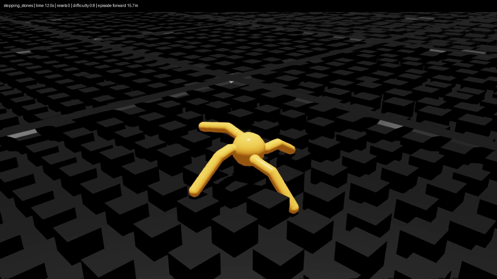

# v5 stepping-stone recovery continuation

This is a continuation of [the measured v5 baseline](ROUGH_V5.md), not a new
benchmark. `Week03-Ant-Rough-Lanes-Eval-v5`, its 30 cm-deep gaps, geometry seed 51,
five difficulty levels, 16-second episodes and strict footprint containment are
unchanged. The course interface remains 60 observations / 8 effort actions,
scale 7.5 and MLP `[400, 200, 100]`. No dependencies were added.

## Final traversal result (2026-09-21)

The rehearsal model improves measured traversal **without increasing the total
terrain fall count** on either the fixed regression set or the new paired set.
It does not make every terrain/difficulty safe, and stone six-tile traversal
remains rare. The original `traverse1499` artifact is retained unchanged.

**Recommended rough-v5 policy** (all frozen promotion gates and independent audit passed):
[`rough_v5_portal_rehearsal4_seed43/model_round_4.pt`](../artifacts/terrain_demo/runs/rough_v5_portal_rehearsal4_seed43/model_round_4.pt).

SHA-256: `889836488fc220963b35acecbb59a1f9a5d371732cf8cfddf08dc700bbca605e`.

| Evaluation set / policy | Strict one-tile | Strict six-tile | Terrain falls | Lane exits | Mean terrain speed |
|---|---:|---:|---:|---:|---:|
| Fixed resets 24/25/26 — reference | 369/450 (82.0%) | 197/450 (43.8%) | 32/450 | 8 | 2.94 m/s |
| Fixed resets 24/25/26 — rehearsal | **403/450 (89.6%)** | **214/450 (47.6%)** | **32/450** | **3** | **3.04 m/s** |
| New paired tests — reference | 472/600 (78.7%) | 256/600 (42.7%) | 61/600 | 11 | 2.86 m/s |
| New paired tests — rehearsal | **517/600 (86.2%)** | **272/600 (45.3%)** | **61/600** | **2** | **3.00 m/s** |

World exits are zero throughout. The new set is generator/reset seeds
**51/28, 51/29, 54/30, 55/30**, 175 first episodes each (150 terrain + 25 flat),
identical for both policies. The checkpoint was frozen before those runs and
was not adjusted afterward. The fixed set includes previously used screening
and regression seeds; it is not a fresh holdout. These are finite simulation
samples, not a claim of statistical equivalence or physical-robot safety.

| Fixed-set family | Reference one-tile / 75 | Rehearsal one-tile / 75 | Reference → rehearsal falls / 75 |
|---|---:|---:|---:|
| Obstacles | 70 | 68 | 4 → 6 |
| Rough | 69 | 70 | 5 → 4 |
| Slope | 72 | 72 | 3 → 3 |
| Stairs | 70 | 71 | 4 → 4 |
| Stepping stones | **24** | **56** | 5 → 6 |
| Waves | 64 | 66 | 11 → 9 |

Stone success by difficulty 0.2/0.4/0.6/0.8/1.0:

- Fixed reference: **12, 11, 1, 0, 0 / 15**; rehearsal: **13, 15, 12, 6, 10 / 15**.
- New reference: **16, 17, 0, 0, 0 / 20**; rehearsal: **20, 19, 12, 8, 10 / 20**.
- Stone six-tile success is only **1/75** fixed and **1/100** new for rehearsal.
  Do not confuse a one-tile clearance with completing all six tiles.
- Some family tradeoffs remain: on new tests obstacle/stair/stone falls rise
  from 10/7/4 to 13/10/11, offset by fewer rough/slope/wave falls. Flat-lane
  falls rise from 5→7/75 fixed and 9→12/100 new, outside terrain denominators.

### Course regression checks

All are 100 first episodes at reset seed 24:

| Scenario | Reference return ± std | Rehearsal return ± std |
|---|---:|---:|
| Course ID | 134.80 ± 29.67 | **137.07 ± 26.83** |
| Low friction | 157.72 ± 28.36 | 155.03 ± 25.25 |
| Heavy torso | 142.79 ± 37.24 | 145.62 ± 31.05 |
| Push | 132.28 ± 34.53 | 135.21 ± 30.25 |
| Assignment-format 100-lane | 57.68 ± 33.70 | 55.18 ± 35.89 |

Course ID retains **88.8%** of the original flat robust reference's 154.32,
above the predeclared 80% floor. Lower 100-lane return does not contradict
higher strict traversal: reward and terrain clearance are different metrics.
There is no claim that every reward/family improves.

Evidence: [fixed-set comparison](../artifacts/terrain_demo/evaluations/rough_v5/rehearsal_summary_20260921.md),
[machine summary](../artifacts/terrain_demo/evaluations/rough_v5/rehearsal_summary_20260921.json),
[frozen selection record](../artifacts/terrain_demo/evaluations/rough_v5/selection_rehearsal_20260921.json),
[independent episode audit](../artifacts/terrain_demo/evaluations/rough_v5/rehearsal_verification_20260921.json).

### Run the rehearsal policy

```bash
CHECKPOINT=artifacts/terrain_demo/runs/rough_v5_portal_rehearsal4_seed43/model_round_4.pt

# Live seven-family demo, difficulty 0.8.
./scripts/run_terrain_demo.sh --task Week03-Ant-Rough-Lanes-Demo-v5 \
  --device cuda:0 --seed 7 --cycle-seconds 8 --checkpoint "$CHECKPOINT" \
  --kit_args=--/renderer/multiGpu/enabled=false

# Strict fixed regression benchmark plus course ID/OOD.
./scripts/evaluate_rough_v5.sh reproduced_rehearsal "$CHECKPOINT" 0

# One of the paired new-geometry tests; use a new output file.
./scripts/run_evaluate.sh --task Week03-Ant-Rough-Lanes-Eval-v5 \
  --headless --device cuda:0 --num_envs 175 --seed 30 --max_steps 960 \
  --checkpoint "$CHECKPOINT" --output outputs/rehearsal_geom54_seed30.json \
  env.scene.terrain.terrain_generator.seed=54 \
  --kit_args=--/renderer/multiGpu/enabled=false
```

### Matched qualitative video

Uncut 16-second, one-environment stone rollouts at difficulty **0.8**, reset
seed **7**, generator **51**, recorded once per model:

- [Original stable policy](../artifacts/terrain_demo/rough_v5_reference_stones08_seed7.mp4)
- [Rehearsal policy](../artifacts/terrain_demo/rough_v5_rehearsal_stones08_seed7.mp4)

At the inspected 15.9 s frames, both have zero resets: the original policy is
at **6.8 m**, the rehearsal policy at **19.2 m**. The final frame includes the
16 s automatic reset; the displayed reset counter is not a fall counter.
These are qualitative clips, not extra benchmark samples or evidence that
all difficult stones are solved. Strict success uses the evaluation JSON.
Both videos passed full FFmpeg decoding: **480 frames, 30 fps, 1280×720**.
[Video hashes/validation](../artifacts/terrain_demo/evaluations/rough_v5/rehearsal_video_20260921.json).



## Diagnosis

`scripts/diagnose_lane_gait.py` records pre-action kinematics and an explicit
first-episode mask. A 25-environment diagnostic (five per stone difficulty,
reset seed 24) of the previous selected `traverse1499` policy found:

| Difficulty | Time with forward speed <0.3 m/s | Distal foot samples below top−0.1 m | Median torso world z |
|---|---:|---:|---:|
| 0.2 | 11.1% | 3.8% | 0.474 m |
| 0.4 | 5.6% | 3.7% | 0.466 m |
| 0.6 | 76.4% | 55.8% | 0.303 m |
| 0.8 | 81.9% | 72.8% | 0.272 m |
| 1.0 | 90.5% | 49.3% | 0.307 m |

These are diagnostic samples after two seconds and before each first reset,
not benchmark success percentages. At difficulty 0.8 one Ant remained at
6.44 m forward displacement from 3 to 15 seconds, with its torso resting on
the stones and feet in gaps. The existing mean ground-height observation can
include gap bottoms; a low torso can therefore still appear elevated relative
to that mean. Neither survival nor this observation proves traversal.

Loaded USD collision geometry confirms that ankle body origins are **not**
foot tips. In foot-name order `front_left_foot`, `front_right_foot`,
`left_back_foot`, `right_back_foot`, distal capsule-centre offsets are
`(+.4,+.4,0)`, `(-.4,+.4,0)`, `(-.4,-.4,0)`, `(+.4,-.4,0)` in link frames;
capsule radius is 0.08 m. Diagnostics save the actual USD transforms.

## Training-only changes

The separate `Week03-Ant-Rough-Lanes-Recovery-Train-v5` task adds:

- A bounded low-torso penalty on the stone family, relative to nominal stone
  tops at world z=0, with target height 0.5 m. There is no extra reward for
  jumping above that target.
- A bounded distal-tip clearance deficit charged only while a foot swings
  forward relative to the torso. Tip velocity uses link velocity plus
  `angular_velocity × rotated_tip_offset`; torso **link** velocity is subtracted
  consistently. Stationary/backward-moving support feet are not charged.
- Shallow-to-deep gaps through **training-instance** Hydra overrides, without
  changing the global generator or evaluating on easier gaps.

These rewards use privileged simulation state only during training; they add
no policy inputs, sensors, terrain scanners or inference-time controller. The
clearance term deliberately targets the distal tip, not every point of the
capsule. Cost reduction alone is not evidence of recovery: slowing foot swing
could reduce it, so unchanged-benchmark crossings and gait motion are checked.

## Reproduce the diagnostic

```bash
../run-python scripts/diagnose_lane_gait.py \
  --checkpoint artifacts/terrain_demo/runs/rough_v5_traverse1499_seed42/model_1499.pt \
  --family stepping_stones --copies 5 --seed 24 --steps 960 \
  --output outputs/stone_gait.npz --headless --device cuda:0 \
  --kit_args=--/renderer/multiGpu/enabled=false
```

The NPZ stores pre-action root/body states, joint positions/velocities,
incoming joint wrenches, actions, distance, ground reference and active mask.
Link-origin velocities are recorded separately: the Isaac Lab `body_state_w`
alias combines link poses with **COM** velocities, which must not be treated
as link-origin velocities when reconstructing tip motion.
The JSON sidecar identifies checkpoint SHA-256, terrain/reset seeds, body/joint
names, limits and collision transforms. Incoming joint wrenches are **not**
contact-sensor measurements. Use the mask; samples after the first reset must
not be pooled into a first-episode comparison.

## Experiment record

The prior selected checkpoint is retained unless a continuation passes the
unchanged terrain and course tests. Reset seed 24 is for candidate screening;
25/26 and geometries 52/53 were used for the first post-selection checks.
After those revealed regressions, the final rehearsal candidate was frozen before
new reset seeds 28/29 and geometry seeds 54/55 (reset 30).

1. **Shallow exploratory warmstart:** traverse1499, std 0.25, reset optimizer,
   fixed LR 7.5e-5, gamma 0.995, entropy 0.002, 4096 environments, 1000 PPO
   iterations. Stone sampling weight 4, flat 2, other families 1; gap depth
   −0.10 m; terminal weight −1200; lane margin 1.1 m.
   The first run had loaded a COM/link velocity mismatch before independent
   review identified it. It is retained only as an exploratory warmstart;
   subsequent runs use the corrected link-consistent formula. The fixed deep-gap
   screen yielded 113/150 terrain successes, 8/25 stone successes (only 1/15
   across difficulty 0.6–1.0), and course ID 149.59. Not adopted as the default.
2. **Intermediate-depth continuation:** starts from shallow999 with std 0.20,
   reset optimizer, the same PPO settings, gap depth −0.20 m and terminal
   weight −1800. The 500-iteration checkpoint gave 117/150 strict terrain
   successes (10/25 stones); the 999-iteration checkpoint regressed to 105/150
   (10/25 stones), despite course ID 153.70. The safer 500-iteration checkpoint
   was chosen only as the next warmstart. Gait diagnostics show higher torso
   posture on easy stones (median z≈0.50 m), but difficulty 0.8 still stalls;
   the curriculum is not considered successful yet.
3. **Full-depth continuation:** from medium500, std 0.25, fixed LR 7.5e-5,
   1500 iterations at the benchmark gap depth −0.30 m. Stone weight 6, flat 2,
   others 1; fall weight −1800, stall −2, stone-body-height weight −3 with
   target 0.55 m; swing settings unchanged. Stronger anti-rest shaping is
   training-only. The 1000-iteration checkpoint produced **129/150 terrain
   successes, 20/25 stone successes**, 19 terrain falls and zero lane exits
   on seed 24; course ID **152.27**. Stone successes by difficulty were
   4/5, 5/5, 4/5, 2/5, 5/5. The later 1499 checkpoint regressed to 120/150
   overall and was not chosen. This was candidate-screen evidence;
   subsequent three-seed validation gave **366/450** terrain successes,
   **55/75** stone successes and **67/450 falls**. The reference had
   369/450 successes and 32/450 falls, so deep1000 was **not promoted**. Diagnostics confirm genuine posture/foot-lift change:
   difficulty 0.8 median torso z rose from 0.272 to 0.387 m and deeply sunk
   foot samples fell from 72.8% to 46.4%; some stalls remain.
4. **Low-noise stabilization / untrapping trial:** preserve deep1000, then
   try std 0.10, LR 5e-5, 800 iterations, fall weight −2400, stone weight 4
   and the full-depth body/stall settings. An optional `trap_weight=1`
   charges sunk feet even if they stop swinging. This closes a measured
   training-reward loophole without penalizing stationary nominal-top contact.
   The cost is `max(swing_cost, trap_weight * clipped_below_top_deficit²)`,
   so it does not double-charge a forward-swinging trapped foot. Default
   `trap_weight=0` retains the original curriculum for reproducibility.
   The 400/799 checkpoints gave 112/150 and 126/150 successes with
   28 and 19 terrain falls, respectively. Neither won the screen. This is a
   composite trial, not a causal ablation of the optional trap cost.
5. **Parameter blending:** 25/50/75% recovery-weight blends with traverse1499
   gave 121/114/115 successes per 150 terrain episodes. The 25% blend lost
   every hard-stone crossing. These blends were rejected.
6. **Actor-only expert rehearsal:** frozen traverse1499 labels non-stone
   states; frozen deep1000 labels stone states. Half of the environments
   approximately use teacher behavior, the remainder the student. Four
   960-step rounds with 1024 environments aggregate simulated states; three
   supervised epochs per round use Smooth L1, batch 4096 and Adam LR 1e-4.
   The final dataset contains 3,932,160 state/action pairs. This is **not PPO**
   and is separate from the original equal-budget course experiment. The
   ungated fourth round gave 127/150 successes, 15 falls and 15/25 stones.
7. **Common-entrance rehearsal:** one bounded repeat uses the stable teacher
   on the flat entrance until the torso reaches 3 m from its centre. Foot
   reach is 1.1 m, so feet may contact terrain starting at 4 m near this
   onset. The training-only gate can still yield ambiguous labels or teacher
   switching near the threshold; lower imitation loss is not proof of robust
   control. Fourth-round screening gave **130/150 successes, 14 falls,
   17/25 stones**, versus 118/150, 14 falls and 7/25 stones for the reference.
   Round two tied at 130 successes but had 15 falls, so round four was frozen
   before all new validation. The exported actor has **no gate, terrain label,
   teacher, extra sensor or runtime switching**; it remains a single 60D/8D
   MLP. Critic/std tensors are unchanged and PPO optimizer moments are cleared.

Local raw logs/kinematics are in ignored `outputs/rough_recovery_20260921/`;
training runs are in ignored `logs/rsl_rl/week03_ant_rough_v5/`. Validated
checkpoints/results are staged into `artifacts/terrain_demo/`, separately from
the original selected policy.

## Reproduce the screen-selected full-depth training stage

The exact intermediate warmstart is retained separately from the selected
inference checkpoint. Use the existing environment; no new packages are needed.
This preserves the source checkpoint and training settings, not a promise of
bit-for-bit GPU training determinism.

```bash
../run-python scripts/prepare_finetune_checkpoint.py \
  artifacts/terrain_demo/runs/rough_v5_recovery_medium500_seed42/model_500.pt \
  logs/rsl_rl/week03_ant_rough_v5/init_recovery_deep_reproduced/model_0.pt \
  --std 0.25 --learning-rate 0.000075

./scripts/run_train.sh --task Week03-Ant-Rough-Lanes-Recovery-Train-v5 \
  --headless --device cuda:0 --num_envs 4096 --max_iterations 1500 --seed 42 \
  --resume --load_run init_recovery_deep_reproduced --checkpoint model_0.pt \
  --run_name recovery_deep_reproduced \
  agent.algorithm.schedule=fixed agent.algorithm.learning_rate=0.000075 \
  agent.algorithm.desired_kl=null agent.algorithm.gamma=0.995 \
  agent.algorithm.entropy_coef=0.002 agent.save_interval=250 \
  env.events.lane_layout.params.family_weights.stepping_stones=6.0 \
  env.rewards.fall.weight=-1800.0 env.rewards.stall.weight=-2.0 \
  env.rewards.stone_body_height.weight=-3.0 \
  env.rewards.stone_body_height.params.target_height=0.55 \
  env.rewards.stone_swing_clearance.params.trap_weight=0.0 \
  env.terminations.lane_departure.params.margin=1.1 \
  --kit_args=--/renderer/multiGpu/enabled=false
```

The full-depth run's `model_1000.pt`, not its later `model_1499.pt`, won its
initial screen but failed default promotion after regression testing.
Its staged `params/` and TensorBoard file retain the actual training configuration
and learning trace. Curriculum depth overrides were removed for this stage:
training and evaluation both use the original −0.30 m pit depth.


## Reproduce single-policy rehearsal

Use a **new** output directory; the trainer refuses to overwrite experiments.
Default `--stone-start-distance 0` reproduces the ungated routing; the measured
portal trial uses 3.0. Training uses seed 43 and unchanged deep gaps. Labels use
privileged lane identity only during training, not at inference.

```bash
../run-python scripts/distill_lane_experts.py \
  --checkpoint artifacts/terrain_demo/runs/rough_v5_recovery_deep1000_seed42/model_1000.pt \
  --reference-checkpoint artifacts/terrain_demo/runs/rough_v5_traverse1499_seed42/model_1499.pt \
  --stone-checkpoint artifacts/terrain_demo/runs/rough_v5_recovery_deep1000_seed42/model_1000.pt \
  --output-run logs/rsl_rl/week03_ant_rough_v5/rehearsal_reproduced \
  --num_envs 1024 --rounds 4 --steps 960 --epochs 3 --batch-size 4096 \
  --learning-rate 0.0001 --stone-start-distance 3.0 --seed 43 \
  --headless --device cuda:0 \
  env.events.lane_layout.params.family_weights.stepping_stones=4.0 \
  --kit_args=--/renderer/multiGpu/enabled=false
```

Staged provenance includes source SHA-256s, parameters, per-round label counts,
realized family/teacher/student counts, losses and TensorBoard. The gate trial
uses 373 stone, 186 flat and 93 environments for each other family. Independent
code review verified frame/reset semantics and the absence of an inference-time
oracle; the possible threshold label conflict is retained as a limitation.

Validation added in this continuation: 36 CPU regression tests, Python
`compileall`, shell syntax and `git diff --check`; recovery training and
actor-rehearsal GPU smoke/full runs. Ruff/mypy/Pyright/LSP are unavailable in
the existing environment. No packages were installed, no remote operation was
performed, and no existing checkpoint or v0–v4 task was replaced.


## Changed files and remaining boundary

This continuation adds bounded reward math and regression tests in
`src/week03_ant/lane_math.py` / `tests/test_lane_math.py`, training-only terms
and task registration in `src/week03_ant/tasks/{lanes,rough_v5_cfg,__init__}.py`,
kinematic recording in `scripts/diagnose_lane_gait.py`, and actor rehearsal in
`scripts/distill_lane_experts.py`. It reuses existing lane state, evaluation,
RSL policy/checkpoint formats and artifact staging rather than adding an
inference controller or dependency. README and this report link the preserved
models, paired clips and independently audited results.

The independent audit recomputed all episode/family/level metrics in **19 JSON
files** (the final 16-run validation batch plus three historical reference runs)
and found **zero discrepancies**. The final batch contains **2,425 first
episodes**, of which **1,725** use the new policy. This excludes candidate
screens and qualitative videos. No further training used the new holdouts.

Remaining limits: only one final training seed; finite simulator trials;
40% success at difficulty 0.8 on both fixed/new sets; very low six-tile stone
success; some family/flat-lane fall regressions despite unchanged total terrain
falls; possible ambiguous teacher labels near ingress. No hardware or arbitrary
terrain guarantee is made. The original equal-budget course results are unchanged.
