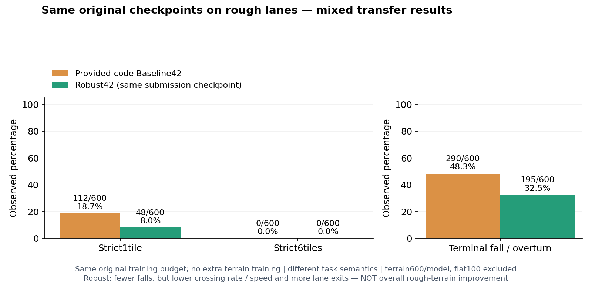
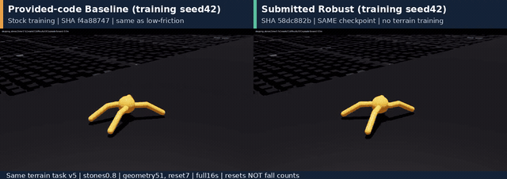

# 동일 제출 모델로 저마찰·험지 비교 — 2026-09-30

**현재 대표 비교는 두 환경 모두 제공 코드 Baseline42 ↔ 제출 Robust42입니다.**
이전 험지 오른쪽의 추가 학습 v5 모델은 대표 비교에서 제외했습니다.
그 수치·영상·checkpoint는 [당시 기록](PROVIDED_BASELINE_COMPARISON.md#험지-전이-비교)으로 보존하며
원래 Robust 결과로 재명명하지 않습니다. 과제 4조건 성능표와 저마찰 영상은 변경하지 않았습니다.

## 학습 seed와 모델 파일은 다릅니다

`training seed42`는 난수 시작값을 맞춰 두 실험을 각각 학습했다는 뜻입니다.
Baseline은 제공 `AntEnvCfg`·`AntPPORunnerCfg` 설정, Robust는 물성·외란·관측 랜덤화 추가 설정입니다.
같은 seed가 같은 가중치, 같은 난수 소비 순서나 초기 상태까지 보장하지는 않습니다.
**서로는 다른 모델이며, 환경을 바꿀 때 각 모델 파일을 그대로 유지했습니다.**

| 모델 | 저장소 checkpoint | 저마찰·험지 공통 SHA-256 |
|---|---|---|
| 제공 코드 Baseline42 | [`baseline_seed42/model_999.pt`](../artifacts/runs/baseline_seed42/model_999.pt) | `f4a88747c8d56905c4889b0fb0708d4e924a81dc676d92561d2921e8b2bdf83b` |
| 제출 Robust42 | [`robust_seed42/model_999.pt`](../artifacts/runs/robust_seed42/model_999.pt) | `58dc882b6fa38f95ea2bd2d4d5f874836e5e043e0b5ae5c62290180122b57864` |

둘 다 학습 seed42, 4,096환경×32steps×1,000iterations = **131,072,000 transitions**입니다.
추가 험지 학습·checkpoint 수정·재선별은 없습니다. Baseline은 제공 코드로 직접 학습한 모델이지
교수가 제공한 pretrained weight가 아닙니다. [제공 코드 정의](PROVIDED_BASELINE_COMPARISON.md#기준선은-무엇인가).
`Week03-Ant-Rough-Lanes-*-v5`의 **v5는 환경 버전**이며 추가 학습 v5 모델을 사용했다는 뜻이 아닙니다.

## 원래 과제 결과 — 변경 없음

동일 예산 두 모델의 ID·저마찰·하중·외란 총800 first episodes 결과는
[README](../README.md#과제-성능--제공-코드-baseline-대비),
[기존 CSV](../artifacts/provided_baseline_comparison_20260930/course_results.csv)에 그대로 있습니다.
OOD 동등가중 평균 return **136.42 → 155.94 (+14.3%)**,
저마찰 **132.97 → 161.69 (+21.6%)**입니다. 과거3seed OOD+10.8%와 혼용하지 않습니다.

## 동일 모델의 험지 전이 결과

고정 `Week03-Ant-Rough-Lanes-Eval-v5`, GPU0, geometry/reset
**51/28·51/29·54/30·55/30**을 두 모델에 똑같이 사용했습니다.
각175환경 첫 episode, 최대960steps(16초); 조합당 험지150+평탄25입니다.
모델당 험지600+평탄100, 두 모델 **1,400 first episodes**입니다.
이 조건은 기존 연구에서 사용했으며 새 독립 holdout이 아닙니다.

| 험지600회/모델 | Baseline42 | 제출 Robust42 |
|---|---:|---:|
| 엄격한 1타일 통과 | 112 (18.7%) | 48 (8.0%) |
| 엄격한 6타일 통과 | 0 (0.0%) | 0 (0.0%) |
| 낙상·전복 종료 | 290 (48.3%) | 195 (32.5%) |
| Footprint 레인 이탈 | 50 | 64 |
| 월드 이탈 | 0 | 0 |
| 평균 전진 속도 | 1.48m/s | 0.92m/s |

통과는 첫 episode의 거리 **13.1m/53.1m** 이상과 무낙상·무전복 종료, 발 범위 레인 유지,
월드 유지를 모두 만족해야 합니다. 거리만 넘는 것은 성공이 아닙니다.
평탄은 통과 판정에서 제외합니다. 56m 레인 loop와 6타일 기준은 다릅니다.

| 지형군 · 각100회/모델 | 1타일 Baseline→Robust | 낙상 Baseline→Robust |
|---|---:|---:|
| Rough | 42 → 16 | 29 → 11 |
| Slope | 21 → 5 | 63 → 53 |
| Stairs | 19 → 11 | 43 → 19 |
| Waves | 5 → 9 | 90 → 69 |
| Obstacles | 23 → 7 | 46 → 26 |
| Stepping stones | 2 → 0 | 19 → 17 |

**낙상은 줄었지만 통과율·속도는 악화되고 레인 이탈은 증가했습니다.**
징검다리6타일은 둘 다0/100입니다. 분모 밖의 평탄100회 낙상은8 → 9입니다.
따라서 이 결과를 “전반적인 험지 성능 개선”이나 “험지 완주”라고 주장하지 않습니다.
원래 과제의 물성 변화 개선이 별도 지형에 그대로 일반화된다는 증거도 아닙니다.

높이·목표·방향 관측의 의미, 보상·종료는 stock Ant와 달라 **별도 전이 benchmark**입니다.
같은60D 입력·같은 원래 학습 예산이라도 원래 과제 return과 직접 비교하지 않습니다.
짝별15개 조건·family/level 할당은 확인했지만 실제 초기 상태·지형 mesh를 별도 덤프하지 않아
byte-identical simulation 상태까지 검증한 것은 아닙니다.
이전 Baseline 평가와도 일부 값이 달라졌으며 실행 간 변동 원인은 분리 검증하지 않았습니다.
과거 수치는 덮어쓰지 않고 이번 재실행만 함께 집계했습니다.



[집계 CSV](../artifacts/same_checkpoint_terrain_20260930/terrain_results.csv) ·
[1,400개 episode CSV](../artifacts/same_checkpoint_terrain_20260930/episode_results.csv) ·
[원시 JSON8개](../artifacts/same_checkpoint_terrain_20260930/evaluations/) ·
[모델 일치·짝 조건·군별 집계](../artifacts/same_checkpoint_terrain_20260930/summary.json)

## 다시 녹화한 징검다리 영상

Baseline42와 **저마찰에서 쓴 바로 그 Robust42**를 각각 한 번 녹화했습니다.
geometry51/reset7, 징검다리 level3(난이도0.8), 1환경, 16초/30fps/480프레임입니다.
재학습·유리한 seed 선별·프레임 컷·배속은 없습니다. reset 후 장면까지 전체 시간을 유지했습니다.
초기 검은 렌더 프레임과 진행 정체 구간도 잘라내지 않았습니다. 통과·완주를 보여주는 성공 영상이 아닙니다.
화면의 `resets`는 낙상 수가 아니며 마지막에는16초 자동 reset이 포함됩니다.
영상은 정성 데모이며 성능표600episode와 별도입니다.

비교 영상은 두 원본을 각각640×360으로 줄여1280×452/H.264로 배치하고,
모델 이름·짧은 checkpoint SHA·“no terrain training”을 표시했습니다.
개별 원본과 비교본 모두 전체 decode, 정확히480프레임/16초를 확인했습니다.
GIF는 같은16초의6fps 보조 미리보기입니다. 저마찰 MP4·기존 영구 첨부는 그대로 재사용합니다.
새 험지 GitHub 재생 첨부는 아직 게시 전입니다.

[](../artifacts/same_checkpoint_terrain_20260930/videos/provided_baseline_vs_robust_seed42_stones08.mp4)

[비교·개별 원본 MP4](../artifacts/same_checkpoint_terrain_20260930/videos/) ·
[조건·SHA·전체 decode](../artifacts/same_checkpoint_terrain_20260930/media_manifest.json)

## 험지 평가·녹화 재현

기존 수업 환경이 설치된 저장소 루트에서 실행합니다. 수업 경로는 PC에 맞게 바꾸세요.
새 출력 경로를 사용하며 기존 결과는 덮어쓰지 않습니다. task의v5를 checkpoint 이름으로 혼동하지 마세요.

```bash
export ROBOTICS_SIM_CLASS_ROOT=/mnt/ssd970/robotics_simulation_class
BASELINE=artifacts/runs/baseline_seed42/model_999.pt
ROBUST=artifacts/runs/robust_seed42/model_999.pt
ROUGH_CHECKPOINT="$ROBUST"  # 저마찰과 동일한 제출 파일
printf '%s  %s\n' \
  f4a88747c8d56905c4889b0fb0708d4e924a81dc676d92561d2921e8b2bdf83b "$BASELINE" \
  58dc882b6fa38f95ea2bd2d4d5f874836e5e043e0b5ae5c62290180122b57864 "$ROUGH_CHECKPOINT" \
  | sha256sum -c - || exit 1
OUT="outputs/same_checkpoint_compare_$(date +%Y%m%d_%H%M%S)"
mkdir -p "$OUT/videos"

for PAIR in '51 28' '51 29' '54 30' '55 30'; do
  read -r GEOMETRY RESET <<< "$PAIR"
  for LABEL in baseline robust; do
    if [[ "$LABEL" == baseline ]]; then CKPT="$BASELINE"; else CKPT="$ROUGH_CHECKPOINT"; fi
    DEST="$OUT/${LABEL}__terrain_geom${GEOMETRY}_seed${RESET}.json"
    test ! -e "$DEST" || exit 1
    ./scripts/run_evaluate.sh --task Week03-Ant-Rough-Lanes-Eval-v5 \
      --headless --device cuda:0 --num_envs 175 --seed "$RESET" --max_steps 960 \
      --checkpoint "$CKPT" --output "$DEST" \
      "env.scene.terrain.terrain_generator.seed=$GEOMETRY" \
      --kit_args=--/renderer/multiGpu/enabled=false || exit 1
  done
done

for LABEL in baseline robust; do
  if [[ "$LABEL" == baseline ]]; then CKPT="$BASELINE"; else CKPT="$ROUGH_CHECKPOINT"; fi
  test ! -e "$OUT/videos/${LABEL}_stones08.mp4" || exit 1
  ./scripts/run_terrain_demo.sh --task Week03-Ant-Rough-Lanes-Demo-v5 \
    --headless --device cuda:0 --seed 7 --family stepping_stones --level 3 \
    --cycle-seconds 16 --checkpoint "$CKPT" --record "$OUT/videos/${LABEL}_stones08.mp4" \
    env.scene.terrain.terrain_generator.seed=51 \
    --kit_args=--/renderer/multiGpu/enabled=false || exit 1
done
```

GUI는 `--headless`·`--record`를 빼고 `--duration 16 --real-time`을 넣습니다.
원래 과제/저마찰은 [기존 두 모델×4조건 명령](PROVIDED_BASELINE_COMPARISON.md#과제-비교-재현),
학습/설치는 [최종 가이드](FINAL_SUBMISSION.md)를 사용합니다.
[실제 실행한10개 명령](../artifacts/same_checkpoint_terrain_20260930/commands.json).

## 검증·보존 경계

독립 감사가 원시8JSON에서 위 수치·성공 판정·분모·짝 메타데이터와 두 파일의
실제/저마찰/험지 SHA 일치를 재검산했습니다. 같은 seed만 보고 모델 동일성을 판단하지 않았습니다.
공개 JSON은 checkpoint 절대경로만 상대경로로 바꾸고 다른 수치·배열·필드를 유지합니다.
[변환 manifest](../artifacts/same_checkpoint_terrain_20260930/metadata_transformations.json).

두1환경 녹화 로그에 `Failed to clone in Fabric` 오류가 남았지만 source env0이 실행되어
각480프레임을 완성하고 exit0으로 끝났습니다. 원인은 분리 검증하지 않았고 simulator 코드를 바꾸지 않았습니다.
오류 없는 런타임이나 실제 로봇·비공개 채점·임의 지형 강건성을 주장하지 않습니다.
원시 console/cache/credentials와 기존 자료의 무결성 복구 백업은 로컬 ignored 경로에 보존합니다.
소스·checkpoint·이전 결과/영상은 보존하고 현재 checksum snapshot만 갱신합니다.
공개 CPU147 subset과 로컬 전체 suite 제약은 [공개 범위](PUBLICATION.md)를 따릅니다.
