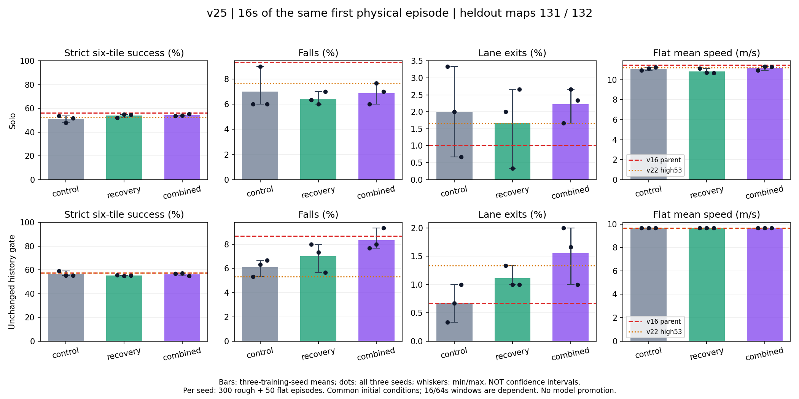
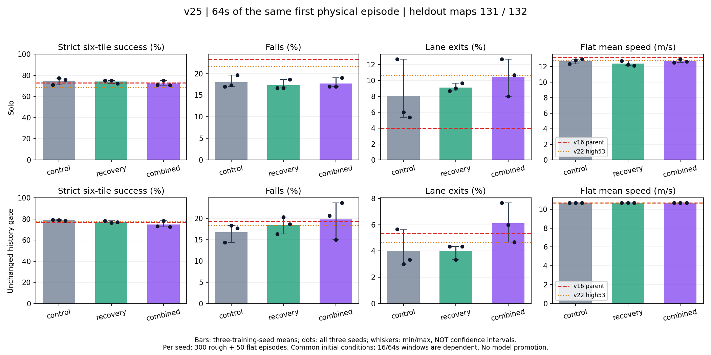
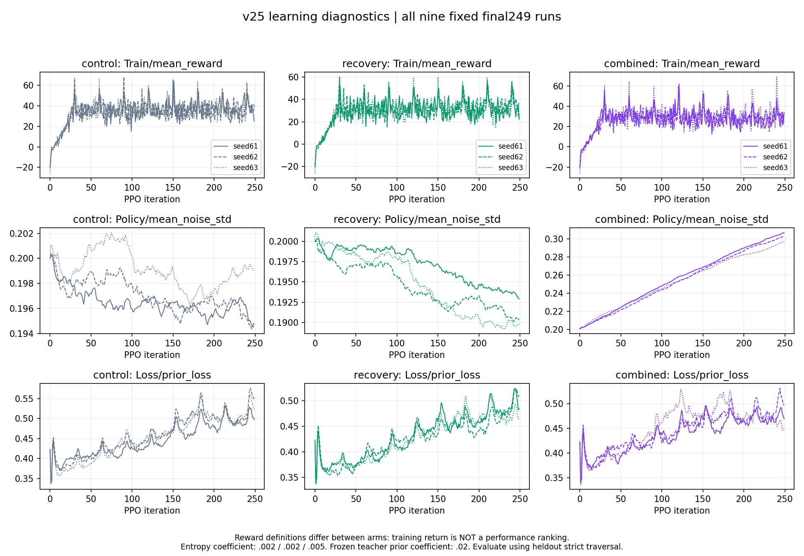
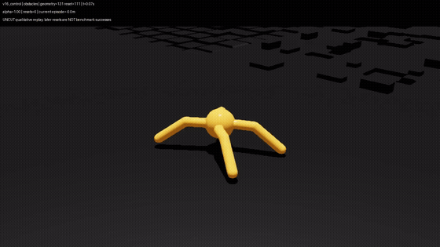
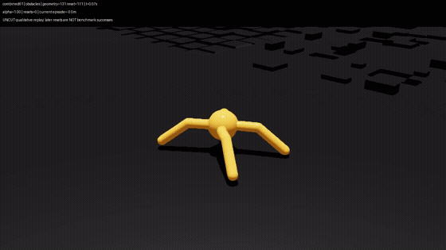

# v25 — 팀원 개선 요소 포팅·동일 예산 학습·새 지도 평가

**실제 학습·평가 완료, 일관된 개선은 확인하지 못했습니다.** 회복 비용과 entropy 증가를
9개 최종 모델로 대조했지만 사전 승격 기준을 통과하지 못해 **기존 기본·제출 정책을 유지**합니다.
**학습 보상만 opt-in으로 변경했고 평가 보상은 원본 그대로입니다.**

[README 요약](../README.md#팀원-요소-포팅--v25-실제-학습과-비교) ·
[원시 결과·모델](../artifacts/terrain_demo/teammate_port_v25/)

## 무엇을 옮겼고, 무엇은 유지했나

두 팀의 최고 return 숫자를 우리 결과와 직접 비교하지 않았다. 서로 다른 지형·보상·종료·예산이기 때문이다.
고정된 공개 소스에서 **우리 과제에 충돌하지 않는 가설 두 가지**만 골라 동일 예산 대조군과 비교한다.

| 근거 | 원래 팀의 관측 | 우리 코드에 포팅한 부분 | 가져오지 않은 부분·한계 |
|---|---|---|---|
| Stick `3cc718a` | 동일 부모·seed42·600iteration의 recovery 묶음에서 생존920→969/1,024, 낙상104→55. 평균속도4.399→4.158m/s | 몸체 지면 여유, upright, 행동 변화, 몸체 roll/pitch 각속도의 연속 벌점 **일부** | 전체 recipe의 global속도 target·추가 terminal벌점·종료·지형 importer는 옮기지 않음. 원래 묶음의 개별 효과는 미분리; smoothing-only는 회귀 |
| Lim `8d9eed1` | 동일 boxes 실험·5seed·1,000iteration에서 entropy0→.005로 heldout return50.7008→62.1660. 낙상19.96→21.28% | 기존 entropy **.002→.005**, 회복 벌점이 있는 조건에서만 추가 비교 | boxes-only 지형, 새 관측·종료·마찰·framework patch·팀원 checkpoint는 옮기지 않음. 낙상 개선의 근거로 쓰지 않음 |

[출처·분모·제한](../artifacts/terrain_demo/teammate_port_v25/research.md)과
[고정 사전 계획](experiment_plans/teammate_port_v25.md)을 참고한다.
이는 Stick 전체 실험이나 Lim의 boxes-only 최종 모델을 **재현한 실험이 아니라 adaptation**이다.
제공된 두 저장소는 읽기만 했고 외부 소스 실행·checkpoint 다운로드·새 의존성 설치는 하지 않았다.

우리 v16은 이미 지형-relative 높이와 발디딤 입력, lane progress/낙상/중앙 유지/돌다리/자세 보상 및
고정 v5 prior가 있다. 따라서 팀원의 보상·센서·종료를 통째로 덮어쓰지 않았다.
수정은 새 opt-in `Week03-Ant-Teammate-v25` 학습 경로에만 넣었으며 기존 정책·평가·기본값은 유지한다.

### 실제 회복 보상

```text
safe_height = min(0.48, 기존 adaptive target height)
clearance_risk = clamp((safe_height - current_posture_clearance)
                       / (safe_height - 0.31), 0, 1)^2
tilt_risk = clamp((0.93 - upright_projection) / (0.93 - 0.5), 0, 1)^2
reward_rate = -2*clearance_risk -2*tilt_risk
              -0.01*sum((action-previous_action)^2)
              -0.025*sum(body_frame_angular_velocity_xy^2)
```

- 기존 825개의 이상적 ray에서 얻은 local-max 지면 기준 posture clearance를 재사용한다.
  Stick의 단일 하향 ray 및 우리 torso 종료의 lane-ground 평균과 동일한 측정이 아니다.
- 높이 target의 상한을 현재 목표로도 제한하여 원래 평지0.44m 목표를 불필요하게 벌주지 않는다.
  invalid scan/target에서는 clearance 항만 abstain하고 횟수를 기록한다. 물리·행동 NaN은 실패다.
- `action_manager.action/prev_action`의 **unscaled action** 차이이다. noisy 이전행동 관측,
  effort 또는 `Δaction/dt`를 사용한 항이 아니다. 몸체-frame x/y 각속도를 사용한다.
- 모든 항은 rate이며 RewardManager가 `dt=1/60`을 **한 번** 곱한다.
  종료 임계값이나 action filtering을 바꾸지 않는다. control도 passive 진단은 계산하되 적용 rate는 정확히0이다.

[수식 구현](../src/week03_ant/teammate_recovery_v25.py) ·
[opt-in 설정](../src/week03_ant/tasks/teammate_v25_cfg.py) ·
[실제 계수·업데이트 감사](../artifacts/terrain_demo/teammate_port_v25/training_audit.json).

## 같은 부모·예산으로 9개를 실제 학습

| arm | 회복 벌점 | entropy | seed | run당 추가 전이 |
|---|---:|---:|---|---:|
| control |0|.002|61/62/63|32,768,000|
| recovery |위 rate|.002|61/62/63|32,768,000|
| combined |위 rate|.005|61/62/63|32,768,000|

- 공통 부모는 v16control final249, SHA `1a937bfa9b33449b6a088471b6202ab4db9d8231131e9f12509f6fe40db737fc`.
  각 seed의 세 arm은 같은 부모 tensor·std0.2 reset·iteration0·fresh empty Adam에서 출발한다.
- `91D/8D`, `[400,200,100]` ELU, effort7.5, teacher prior0.02,
  LR1e-4 fixed, gamma.995, 모든 기존 관측/보상/종료 및 6험지+평지 분포는 그대로다.
  frozen v5 SHA `889836488fc220963b35acecbb59a1f9a5d371732cf8cfddf08dc700bbca605e`는 학습 중 정확히 보존한다.
- 새 훈련 geometry130, 각 `4,096env×32step×250iteration`.
  **9개 본학습294,912,000전이**, 각 실제8,000policy-step/250PPO-update/5,000Adam-step이다.
  seed61 control→recovery→combined, seed62와63도 같은 순서로 한 GPU에서 순차 실행했다.
- 최종 **`model_249.pt`만** 평가한다. 중간 checkpoint/유리한 seed/지도/weight를 재선택하지 않는다.
  원래 v16 부모 대비에는 추가학습 효과가 섞이므로 **동일 추가학습 control**을 주 대조군으로 삼았다.
- `combined-control`이 주요 비교, `recovery-control`과 `combined-recovery`가 보조 비교다.
  후자는 recovery가 있을 때 entropy 증가의 조건부 효과이며 entropy-only·상호작용·개별 보상항 효과는 식별하지 않는다.

### 사전 검증과 반복 비용 공개

수정본 전체 CPU2,276테스트, small3조건·4096env capacity9조건 및 독립 감사를 통과했다.
초기 물리 상태·관절·91D 관측·CPU/CUDA RNG와 actor/critic/teacher 평균 및 실제 episode-length-buffer를 비교했다.
8개 development endpoint의280첫 episode/560의존 window도 부모와 환경별로 정확히 일치했다.
개발 지도51/reset24는 본 holdout이 아니다.

첫 development cycle의 score0 cache preparation 후 Isaac `app.close()`가 프로세스를 끝내는
metadata wrapper 오류를 발견했다. 숫자 평가 루프는 유지하고 outer-parent/numerical-child로만 수정한 뒤
전체 검증을 새 소스에서 반복했다. 최초 오류 prepare는 **0step/0score**이고 본학습·holdout 선택은 하지 않았다.
첫 cycle의20개 소스·증거·로그83파일은 로컬에 원본 byte로 보존했다.
유효 개발2,408,448 + 반복 개발2,408,448 = **실제 개발4,816,896전이**이다.
본학습을 포함한 실제 총학습 전이는 **299,728,896**이다. 이것은 부모·교사의 과거 훈련량을 포함한 총 lifetime budget이 아니다.
[반복 기록](../artifacts/terrain_demo/teammate_port_v25/development_recovery.json) ·
[사전 승인](../artifacts/terrain_demo/teammate_port_v25/reviews/pre-main-verification-final.md).

## 새로운 지도에서 바꾸지 않은 평가

**사용자 제약: 학습 보상은 바꿔도 평가 보상은 변경하지 않는다.**
추가 recovery reward는 `TeammateTrainAntEnvCfg`에만 들어간다.
평가는 기존 `Week03-Ant-Contact-v16-Eval-v0`의 보상·종료·성공 기준을 모든23controller에 그대로 적용한다.
기존 evaluator/contact-v16/rough-v5 설정의 원본 byte 및 SHA도 유지했다.
이 험지 연구 protocol은 60D 제출 과제의 stock return 평가와 별도이며 두 숫자를 섞지 않는다.


- geometry/reset **131/111,132/112**, 두 지도 모두 동일175환경:
  7family×5난이도×5시작상태. controller당300험지+50평지이다.
  기록된 과거166training-config 및1,158공개 JSON을 검사하여130/131/132가 없음을 확인했다.
  이는 **기록된 archive 범위의 미사용**이며 기록되지 않은 외부 실험까지 증명하는 주장이 아니다.
  훈련에 없던 terrain family가 아니라 훈련과 같은 family의 **새로 생성된 배치**이다.
- 기존5참고선 `v5,v16_control,history_control,high53,history_high53`과
  새9개 단독+9개 동일 history gate로 **23controller×2지도=46주행 파일**을 평가했다.
  참고선은 지도당 한 번만 실행했지 3개의 독립 training-seed처럼 복제하지 않았다.
- 본 평가 **8,050물리 first episode**, 동일 주행의16/64초 **16,100의존 window**이다.
  비교의 paired 초기 조건은350개이지8,050개의 독립 랜덤 지도가 아니다.
  개발280episode 및 정성 영상의 재주행은 이 분모에 넣지 않는다.
- 물리 episode는 최대64초/3,840step이며16초 snapshot은 상태·RNG·gate·reset을 건드리지 않는다.
  첫 episode 이후 실제 reset은 영상을 위해 유지하지만 benchmark에 새 성공으로 세지 않는다.
- 성공은 float32로 기록된 **최종** 거리≥13.1m(1tile)/53.1m(6tiles)이며
  first-episode 누적 낙상·레인·world 이탈이 모두 없어야 한다.
  최대 거리·첫 도달·생존만으로 성공을 계산하지 않는다. **53.1m는6미터가 아니다.**
- geometry/config/초기 물리·관절·full observation/CPU·CUDA RNG hash를 실제 비교해 짝을 확인한다.
  evaluator는 기존 `evaluate_unseen_terrain.py` SHA `cf512d2833d5d3a1d808735cf40a1b91cbbbc6d80db2928acc22982450bcd422` 그대로이다.
  adapter는 `CONTROLLERS,SCHEMA,resolve_model` 세 binding만 교체한다.
- history는 기존 depth-history gate 그대로이다. family label로 policy를 고르는 것이 아니며
  v5도 혼합훈련 모델이라 **순수 평지/험지 전문가 분리**로 부르지 않는다.
  high53은 정확히 v22seed53final249이고 v24 단기 probe가 아니다.

### 사전 고정 판정

주요16초에서 strict1/6tile 비감소, 험지 낙상·레인 이탈 비증가, world0,
평지 낙상·레인 비증가, 단독 평지 평균속도 비감소 및 strict 성공 하나 이상 증가가 필요하다.
각 seed가 **각 지도와 두 지도 합산 모두 PASS**, arm은 **3/3seed PASS**여야 한다.
합산 이득으로 실패 seed/지도를 숨기지 않는다. history에는 평지 v5 branch의 모든 환경별 raw identity도 요구한다.
64초는 별도 진단이며16초 실패를 구제하지 않는다. gate를 통과해도 기본/제출 정책을 자동 교체하지 않는다.

## 결과

**결론: 모든 arm의16초 주요 승격 gate는 FAIL(0/3seed),64초도 arm-level PASS가 없다.**

단독 결합군은16초 합산6타일이460→489/900(+29, +3.22percentage points)지만 레인18→20으로 늘었다.
64초6타일은672→650/900, 레인은72→94로 회귀했다. 추가학습 control을 이기거나 부모·기본정책을 대체하는 일관된 개선으로 채택하지 않는다.
900은3개모델×동일300험지조건의 서술적 합산이지900개의독립지도/훈련seed가 아니다.

### 16초 — 동일 첫 주행의 주요평가

각 controller당 **험지300·평지50**, world 이탈은 모든 행0. 단독과 history는 같은 checkpoint의 다른 실행 구조이다.

| controller | 1타일 | 6타일 | 험지 낙상 | 험지 레인 | 평지 낙상 | 평지 속도m/s | 고정 평가 return: 험지 평균±populationSD |
|---|---:|---:|---:|---:|---:|---:|---:|
| v5 | 260 | 132 | 26 | 1 | 2 | 9.660 | 45.01 ± 19.01 |
| v16_control | 269 | 169 | 28 | 3 | 0 | 11.468 | 50.18 ± 19.11 |
| history_control | 272 | 172 | 26 | 2 | 2 | 9.660 | 49.49 ± 19.31 |
| high53 | 272 | 157 | 23 | 5 | 0 | 11.224 | 49.22 ± 18.61 |
| history_high53 | 280 | 172 | 16 | 4 | 2 | 9.660 | 49.97 ± 18.47 |
| control61 | 272 | 161 | 18 | 10 | 1 | 10.929 | 49.99 ± 18.44 |
| recovery61 | 275 | 156 | 19 | 6 | 1 | 11.134 | 48.84 ± 18.25 |
| combined61 | 277 | 161 | 18 | 5 | 0 | 10.952 | 49.02 ± 18.50 |
| control62 | 267 | 144 | 27 | 6 | 0 | 11.140 | 46.28 ± 18.29 |
| recovery62 | 281 | 165 | 18 | 1 | 2 | 10.712 | 49.05 ± 18.92 |
| combined62 | 269 | 162 | 23 | 8 | 0 | 11.321 | 49.82 ± 19.11 |
| control63 | 279 | 155 | 18 | 2 | 2 | 11.264 | 48.16 ± 17.55 |
| recovery63 | 271 | 164 | 21 | 8 | 1 | 10.670 | 49.98 ± 19.14 |
| combined63 | 273 | 166 | 21 | 7 | 0 | 11.302 | 49.57 ± 18.60 |
| history_control61 | 282 | 177 | 16 | 1 | 2 | 9.660 | 50.22 ± 19.06 |
| history_recovery61 | 272 | 167 | 24 | 4 | 2 | 9.660 | 49.85 ± 18.93 |
| history_combined61 | 271 | 170 | 23 | 6 | 2 | 9.660 | 49.55 ± 18.93 |
| history_control62 | 279 | 166 | 19 | 2 | 2 | 9.660 | 49.07 ± 18.86 |
| history_recovery62 | 275 | 165 | 22 | 3 | 2 | 9.660 | 49.77 ± 18.57 |
| history_combined62 | 270 | 171 | 24 | 5 | 2 | 9.660 | 50.24 ± 19.08 |
| history_control63 | 276 | 166 | 20 | 3 | 2 | 9.660 | 48.95 ± 18.95 |
| history_recovery63 | 279 | 166 | 17 | 3 | 2 | 9.660 | 49.88 ± 18.14 |
| history_combined63 | 269 | 165 | 28 | 3 | 2 | 9.660 | 49.80 ± 18.66 |

평가 return은 기존 보상을 바꾸지 않고 기록된 first-episode 누적값을 사후 요약한 보조지표이며, 사전 strict gate/선택을 바꾸지 않는다. 서로 다른 horizon return을 직접 순위 비교하지 않는다.

| 비교 | arm 판정 | 통과seed | seed61: 지도131/132/합산 | seed62: 지도131/132/합산 | seed63: 지도131/132/합산 |
|---|---|---:|---|---|---|
| recovery_vs_control | FAIL | 0/3 | FAIL/PASS/FAIL | FAIL/FAIL/FAIL | FAIL/FAIL/FAIL |
| combined_vs_recovery | FAIL | 0/3 | FAIL/FAIL/FAIL | FAIL/FAIL/FAIL | PASS/FAIL/PASS |
| combined_vs_control | FAIL | 0/3 | FAIL/FAIL/PASS | FAIL/PASS/FAIL | FAIL/FAIL/FAIL |
| history_recovery_vs_control | FAIL | 0/3 | FAIL/FAIL/FAIL | FAIL/FAIL/FAIL | FAIL/PASS/PASS |
| history_combined_vs_recovery | FAIL | 0/3 | FAIL/PASS/FAIL | FAIL/FAIL/FAIL | FAIL/FAIL/FAIL |
| history_combined_vs_control | FAIL | 0/3 | FAIL/FAIL/FAIL | FAIL/PASS/FAIL | FAIL/FAIL/FAIL |

### 64초 — 동일 첫 주행의 진단 window

각 controller당 **험지300·평지50**, world 이탈은 모든 행0. 단독과 history는 같은 checkpoint의 다른 실행 구조이다.

| controller | 1타일 | 6타일 | 험지 낙상 | 험지 레인 | 평지 낙상 | 평지 속도m/s | 고정 평가 return: 험지 평균±populationSD |
|---|---:|---:|---:|---:|---:|---:|---:|
| v5 | 235 | 223 | 56 | 8 | 5 | 10.681 | 175.75 ± 86.26 |
| v16_control | 220 | 219 | 70 | 12 | 5 | 13.171 | 189.61 ± 90.42 |
| history_control | 231 | 230 | 58 | 16 | 5 | 10.681 | 192.20 ± 87.39 |
| high53 | 206 | 205 | 65 | 32 | 1 | 12.809 | 188.77 ± 84.92 |
| history_high53 | 233 | 233 | 55 | 14 | 5 | 10.681 | 195.04 ± 82.70 |
| control61 | 213 | 213 | 51 | 38 | 4 | 12.350 | 195.02 ± 84.91 |
| recovery61 | 227 | 225 | 50 | 26 | 2 | 12.712 | 194.55 ± 83.82 |
| combined61 | 216 | 213 | 51 | 38 | 0 | 12.522 | 193.31 ± 85.03 |
| control62 | 233 | 232 | 52 | 18 | 3 | 12.834 | 182.37 ± 83.89 |
| recovery62 | 226 | 225 | 50 | 27 | 3 | 12.254 | 192.95 ± 83.51 |
| combined62 | 226 | 225 | 51 | 24 | 0 | 12.940 | 196.35 ± 87.39 |
| control63 | 227 | 227 | 59 | 16 | 3 | 12.933 | 187.04 ± 80.72 |
| recovery63 | 217 | 217 | 56 | 29 | 5 | 12.119 | 195.90 ± 87.99 |
| combined63 | 213 | 212 | 57 | 32 | 2 | 12.659 | 192.09 ± 85.19 |
| history_control61 | 241 | 238 | 43 | 17 | 5 | 10.681 | 197.32 ± 83.27 |
| history_recovery61 | 238 | 235 | 49 | 13 | 5 | 10.681 | 194.36 ± 85.78 |
| history_combined61 | 219 | 219 | 62 | 23 | 5 | 10.681 | 190.60 ± 87.09 |
| history_control62 | 237 | 237 | 55 | 9 | 5 | 10.681 | 189.08 ± 84.68 |
| history_recovery62 | 229 | 229 | 61 | 10 | 5 | 10.681 | 192.54 ± 84.54 |
| history_combined62 | 237 | 235 | 45 | 18 | 5 | 10.681 | 195.65 ± 86.36 |
| history_control63 | 239 | 235 | 53 | 10 | 5 | 10.681 | 190.49 ± 84.06 |
| history_recovery63 | 233 | 231 | 56 | 13 | 5 | 10.681 | 195.01 ± 83.34 |
| history_combined63 | 218 | 218 | 71 | 14 | 5 | 10.681 | 188.19 ± 87.23 |

평가 return은 기존 보상을 바꾸지 않고 기록된 first-episode 누적값을 사후 요약한 보조지표이며, 사전 strict gate/선택을 바꾸지 않는다. 서로 다른 horizon return을 직접 순위 비교하지 않는다.

| 비교 | arm 판정 | 통과seed | seed61: 지도131/132/합산 | seed62: 지도131/132/합산 | seed63: 지도131/132/합산 |
|---|---|---:|---|---|---|
| recovery_vs_control | FAIL | 1/3 | PASS/PASS/PASS | FAIL/FAIL/FAIL | FAIL/FAIL/FAIL |
| combined_vs_recovery | FAIL | 0/3 | FAIL/FAIL/FAIL | FAIL/FAIL/FAIL | FAIL/FAIL/FAIL |
| combined_vs_control | FAIL | 0/3 | FAIL/FAIL/PASS | FAIL/FAIL/FAIL | FAIL/FAIL/FAIL |
| history_recovery_vs_control | FAIL | 0/3 | FAIL/FAIL/FAIL | FAIL/FAIL/FAIL | FAIL/PASS/FAIL |
| history_combined_vs_recovery | FAIL | 0/3 | FAIL/FAIL/FAIL | FAIL/FAIL/FAIL | FAIL/FAIL/FAIL |
| history_combined_vs_control | FAIL | 0/3 | FAIL/FAIL/FAIL | FAIL/FAIL/FAIL | FAIL/FAIL/FAIL |

### 합산 이득으로 실패 지도를 숨기지 않음

- combined61-control61의16초 합산은 PASS지만 지도131에서6타일88→85,지도132에서낙상12→14로 **둘 다FAIL**이다.
- combined62-control62는16초6타일144→162·낙상27→23이나 레인6→8로 FAIL이다. combined63도155→166이나 낙상18→21·레인2→7로 FAIL이다.
- recovery62는16초6타일144→165·낙상27→18·레인6→1이지만 평지낙상0→2·속도11.140→10.712m/s로 FAIL이다.
- 64초 recovery61-control61만 두 지도 및 합산 PASS(6타일213→225,낙상51→50,레인38→26)다. 다른 두 seed가실패하므로 arm은 **1/3,FAIL**이고16초실패를구제하지않는다.
- 모든 history 조합의 평지 raw branch는v5와 환경별로 정확히 같았다. history 실패는 평지 identity 변조가 아니라 **험지 성능조건** 때문에 발생했다.

[모든 지도·seed 실패 조건과 짝6타일 gains/losses](../artifacts/terrain_demo/teammate_port_v25/seed_map_gates.csv) ·
[모든 controller/지도 수치](../artifacts/terrain_demo/teammate_port_v25/controller_results.csv) ·
[family별 원본집계](../artifacts/terrain_demo/teammate_port_v25/family_results.csv).

### 지형별 효과 — 같은 family의 새 배치

각 arm은3seed 합산family당150조건(동일50시작조건을3개모델에재사용). 아래 값은 **6타일/낙상/레인** 횟수이며family별최고모델을선택하거나gate를바꾸는표가아니다.

| window | family | control | recovery | combined |
|---|---|---:|---:|---:|
| 16s | rough | 118/9/5 | 121/7/8 | 128/7/6 |
| 16s | slope | 74/9/0 | 81/7/0 | 73/11/1 |
| 16s | stairs | 59/4/1 | 61/8/0 | 64/8/1 |
| 16s | waves | 118/17/0 | 116/17/0 | 121/15/1 |
| 16s | obstacles | 80/10/7 | 91/10/3 | 85/10/8 |
| 16s | stepping_stones | 11/14/5 | 15/9/4 | 18/11/3 |
| 64s | rough | 111/19/20 | 109/17/24 | 105/16/32 |
| 64s | slope | 119/30/1 | 124/26/0 | 118/25/7 |
| 64s | stairs | 133/15/2 | 132/16/2 | 123/21/7 |
| 64s | waves | 124/25/1 | 121/27/2 | 118/27/5 |
| 64s | obstacles | 103/30/20 | 108/21/23 | 98/31/22 |
| 64s | stepping_stones | 82/43/28 | 73/49/31 | 88/39/21 |

**기존 모델 참고:** 같은 두 지도에서 단독16초 v16부모169/300이 모든 새단독최종(최대combined63의166)보다 높다.
전체 history 포함16초 최고177/300과64초 최고238/300은 **포팅 없는 추가학습control61+기존history gate**이다.
이는 기록된 후보들의 이 지도·시간별 최대값이라는 사후 서술이지, 그 seed의 승격이나 일반적최고모델을 보장하지 않는다.
평지/험지순수전문가분리나terrain-name별model교체를 새성공원인으로 부르지 않는다.





막대는3seed 평균, 점은세seed 모두, whisker는min/max이며 **신뢰구간이 아니다**.

## 무엇 때문에 좋아졌나 — 해석의 범위

### 회복 비용의 부분적 이득과 회귀

같은 예산의 `recovery-control` 단독 3seed 합산에서 16초 6타일은 **460→485/900**,
험지 낙상은 **63→58**, 레인 이탈은 **18→15**였다. 그러나 평지 낙상은 **3→4/150**,
평지 평균속도는 **11.111→10.839m/s**로 나빠졌다. 새 회복 비용이 모든 조건의 강건성을
개선했다고 할 수 없으며, 네 항을 함께 추가했으므로 항별 인과 기여도도 분리하지 못한다.

### entropy 증가가 무조건 더 좋은 보행을 만들지는 않음

회복 비용을 유지한 `combined-recovery`의 16초 6타일은 **485→489/900**이지만,
낙상은 **58→62**, 레인은 **15→20**으로 늘었다. 64초 6타일은 **667→650/900**,
레인은 **82→94**로 회귀했다. Lim의 entropy0→.005 결과가 이미 .002를 쓰는 우리
지형·보상·prior 학습에도 그대로 전이된다고 가정하지 않는다.

실제 최종 policy std는 control **0.1946–0.1989**, recovery **0.1897–0.1929**,
combined **0.2973–0.3067**이었다. entropy는 **훈련의 행동 샘플링**에 영향을 주며,
이번 평가는 deterministic actor 평균을 사용한다. 평가 action에 랜덤 noise를 더하거나
새 smoothing filter를 넣은 것이 아니다. 증가한 탐색이 다른 보행 해법을 찾도록 했을
가능성은 있으나, 이 진단만으로 성공 원인이나 성능 향상을 확정하지 않는다.

3seed 전체 실제 훈련 step의 평균 clearance risk는 control **0.06306**,
recovery **0.05968**, combined **0.05850**이었다. 반면 tilt risk는
**0.00638→0.00659→0.00683**, 몸체 angular-velocity-xy 제곱합은
**4.242→4.241→4.416**이었다. 모든 자세·흔들림 지표가 함께 좋아졌다고 쓰지 않는다.
이 값은 달라진 학습 궤적의 **서술적 노출 진단**이지 동일 상태에서의 기전 대조나 평가 성능이 아니다.



[실제 scalar와 std](../artifacts/terrain_demo/teammate_port_v25/training_curves.json) ·
[각 run의 실제 8,000step 진단](../artifacts/terrain_demo/teammate_port_v25/training_diagnostics.json).
각 arm의 학습 reward 정의가 다르므로 training-return 곡선으로 모델을 순위 매기지 않는다.

**따라서 “무엇 때문에 성능이 더 좋아졌다”의 결론은 제한적이다.** 동일 추가학습 대조에서
단기 일부 지표에 이득이 있었지만, 지도·seed·시간·평지까지 유지하는 개선은 실패했다.
기존 60D Baseline42 대비 제출 Robust42의 물성 개선은 [별도 비교](PROVIDED_BASELINE_COMPARISON.md)이며,
이번 v25의 +3.22percentage points와 기존 +14.3% OOD return을 섞지 않는다.

## 영상

사전에 지정한 `combined61` 대 v16부모의 geometry131/reset111,
obstacles 난이도4,16초 단일환경 재주행이다. 최고 seed를 뽑은 영상이 아니다.
원본은 실패·reset을 포함한480frame/30fps/16초 전체 시간축을 유지하며 benchmark 분모에는 넣지 않는다.
| 고정 모델 | 정성 GIF 미리보기 | 전체 원본 MP4 |
|---|---|---|
| v16 부모 | [GIF](../artifacts/terrain_demo/teammate_port_v25/media/v16_control.gif) | [MP4](../artifacts/terrain_demo/teammate_port_v25/media/v16_control.mp4) |
| combined seed61 | [GIF](../artifacts/terrain_demo/teammate_port_v25/media/combined61.gif) | [MP4](../artifacts/terrain_demo/teammate_port_v25/media/combined61.mp4) |





두 실행의 실제 지형·초기 root/joint/full-observation/CPU·CUDA RNG hash가 일치한다.
이 한 조건에서 부모는 첫 episode 거리 **14.451m·낙상·6타일 실패**,
combined61은 **53.226m·무낙상·6타일 성공**이었다. **n=1 정성 예시이며 전체 FAIL 판정을 뒤집지 않는다.**
GIF는 전체16초를10fps/560px로 축소한 미리보기이고 원본 MP4는480frame/30fps/16초/1280×720이다.
startup 검은 프레임·실패·reset을 잘라내지 않았다. 렌더링 없는 평가와 별도 render-equivalence 재검증을
했다고 주장하지 않으며, 이전 수치 benchmark를 영상 점수로 대체하지 않는다.
[사전 선택·모델·소스](../artifacts/terrain_demo/teammate_port_v25/media/frozen.json) ·
[영상 SHA·프레임·초기 짝 증명](../artifacts/terrain_demo/teammate_port_v25/media/manifest.json).
원본과 GIF는 저장소 파일로 공개한다. 별도의 GitHub attachment/issue/release를 생성하지 않았다.

## 재현 및 무결성

### 공개 checkout의 검증 범위

```bash
# 저장소 root, CPython 3.11/3.12에서 표준 라이브러리만 사용
python3 -S scripts/verify_teammate_publication_v25.py
sha256sum -c artifacts/PUBLICATION_SHA256SUMS
```

공개 verifier는 source20/base6/모델23binding 및 공개 파일 SHA, 46개 enriched/raw 쌍,
모든 환경별 기록 배열로 계산한 **8,050 first episodes / 16,100 의존 window / 350 짝 조건**,
모든 집계·지도별·seed별 gate를 검증한다. TensorBoard·GPU·Torch·Isaac·checkpoint unpickling이
필요하지 않으며, simulation이나 training을 재실행하는 도구가 아니다.
검토한 신뢰 가능한 checkout에서 실행해야 한다. 자체 manifest는 독립적인 authenticity trust anchor가 아니다.

CPython3.12의 float `sum`은 원래3.11 실행과 마지막 bit가 달라질 수 있다. 공개 helper만
항상 명시적 **historical left-to-right addition**을 사용하도록 별도 사후 수정했다.
검증 후 import한 auditor 모듈의 `sum` 이름만 바인딩하며 전역 builtins나 frozen auditor byte를 바꾸지 않는다.
전체 canonical의 **385,488개 노드·56,974개 IEEE754 float**를 원래3.11 무패치 결과와
adapted3.11/3.12 결과 사이에서 정확히 비교했다. 모든 집계·gate·배열 기록이 일치했다.
수치 tolerance를 늘리거나 실패 후 fallback을 쓰거나 원래 summary/임계값을 고치지 않는다.
[실제 전체 교차 버전 증명](../artifacts/teammate_port_v25_publication/arithmetic-parity.json) ·
[별도 구현 검토](../artifacts/teammate_port_v25_publication/arithmetic-review.md).
이 helper는 과학 freeze20이나 학습/평가 simulation의 입력이 아닌 presentation 도구다.
이전/현재 helper SHA와 수정 이유는 publication manifest의 `presentation_revision`에 남겼다.

### 원본 검증과 공개 메타데이터의 SHA는 구분

공개 전에 실제9개 학습의 tensor·Adam·teacher·schedule·8,000step 진단·250scalar,
원본 cache/config/실행 시각·초기 물리·관측·RNG·46raw 파일을 독립 감사했다.
[학습 감사](../artifacts/terrain_demo/teammate_port_v25/training_audit.json),
[독립 평가 감사](../artifacts/terrain_demo/teammate_port_v25/independent_audit.json),
[영상 후 원본 재감사](../artifacts/terrain_demo/teammate_port_v25/post_demo_raw_audit.json),
[737개 결과 검증](../artifacts/terrain_demo/teammate_port_v25/reviews/post-main-outcome-verification.md)에서
확인할 수 있다. 실제 전체 CPU **2,286 PASS, 실패·오류·skip0**은 모든 학습·수치 평가 뒤,
공개 경로 투영 전에 실행한 결과다([기록](../artifacts/terrain_demo/teammate_port_v25/cpu_validation_final.json)).
투영·presentation 산술 수정 후 전체 CPU도 **2,288 PASS +37 subtests PASS, 실패·오류·skip0**였고,
실제 공개 helper를 CPython3.11.16/3.12.3에서 각각 실행해 **484파일·46기록·8,050/16,100 집계 PASS**를 확인했다.
[최종 공개 검증](../artifacts/teammate_port_v25_publication/validation.json).

이후 원본을 로컬 ignored backup에 그대로 보존하고 **명시적 경로·hostname 문자열/경로 key만** portable하게
투영했다. JSON의 모든 숫자·형식·배열 순서·signed zero, YAML 구조, 모든 체크포인트와 고정 source20은 유지한다.
기존 audit/freeze의 SHA는 **원래 실행 byte 기준**이고 투영된 공개 JSON의 SHA와 다를 수 있다.
[원문→공개 SHA 대응](../artifacts/terrain_demo/teammate_port_v25/publication_metadata.json)을 함께 읽는다.
`training_frozen.json`과 `trained_models.json`의 literal binding bytes도 그대로여서
9개 공개 holdout model binding을 모두 재검증했다.

`<course-environment>`, `<course-sdk>`, `<course-launcher>`, `<terrain-cache>`,
`<isaac-local-logs>`, `<user-home>`, `<local-host>`는 외부 실행환경의 논리적 이름이지
checkout 안에 만들어 놓은 경로가 아니다. console·TensorBoard·terrain cache·credential·세션DB·장치 telemetry는
게시하지 않는다. 공개 표준라이브러리 replay는 **공개 byte/배열의 일관성**을 검증한다.
private 원문이 없으므로 공개 독자가 원문과의 수치 동등성을 독립적으로 증명할 수는 없고,
그 관계는 로컬 publisher의 기록이다. historical full-runtime audit를 checkout만으로 재실행할 수 있다고 하지 않는다.

### 새 시뮬레이션과 학습의 실행 경계

실제 실행 명령·종료코드 JSON은 [holdout 실행](../artifacts/terrain_demo/teammate_port_v25/evaluations/_execution/),
[본학습 schedule](../artifacts/terrain_demo/teammate_port_v25/training/),
[고정 학습 입력](../artifacts/terrain_demo/teammate_port_v25/training_frozen.json)에 있다.
각 run의 최종249와 `params/agent.yaml,env.yaml`은 [9개 run](../artifacts/terrain_demo/teammate_port_v25/runs/)에,
공통 초기 weight의 원본 binary 사본은 [seed별 initializer](../artifacts/terrain_demo/teammate_port_v25/initializers/)에 있다.

course 환경(Isaac Sim5.1/Isaac Lab2.3, 설치된 distribution0.47.2, Torch2.7.0+cu128,
RSL-RL3.0.1)을 활성화하고 **한 번에 한 GPU 작업**, **새 output 이름**으로 예를 들면:

```bash
# ROOT에서 활성화한 course Python 사용; 기존 결과를 덮어쓰지 않음
python scripts/evaluate_teammate_v25.py --phase holdout --controller combined61 \
  --geometry 131 --seed 111 --num-envs 175 --seconds 64 --device cuda:1 \
  --output outputs/v25_fresh_replay/combined61_g131_r111.json
python scripts/record_teammate_demo_v25.py --controller combined61 \
  --output outputs/v25_fresh_demo/combined61.json \
  --record outputs/v25_fresh_demo/combined61.mp4
```

이것은 고정 모델로 **새 실행**을 하는 예시이며 기록된 원본 byte/시각까지 재생성한다는 뜻이 아니다.
9run 학습 harness는 exclusive namespace와 development/cache/initializer/raw-runtime proof를 요구한다.
공개된 historical 명령의 논리적 경로를 그대로 shell에 붙여 재학습할 수 있다고 주장하지 않는다.
재학습 연구는 새 namespace·freeze·캐시·development 증명을 준비해야 하며
기존 부모/교사/default나 이번23controller·seed·지도·판정을 덮어쓰면 안 된다.

## 귀속과 남은 제한

- 두 원문의 pinned commit·BSD-3-Clause 고지는 [THIRD_PARTY_NOTICES](../THIRD_PARTY_NOTICES.md)와
  [원문 라이선스](../licenses/teammate_ant_BSD-3-Clause.txt)에 있다. 이름은 귀속이며 endorsement가 아니다.
- 하나의 부모·훈련geometry·3seed·2holdout은 일반적인 우월성, 실물 로봇 안전 또는 센서 noise 강건성을 보장하지 않는다.
- 이상적 height scan을 사용한다. 모든 비교가 공통 초기 조건을 재사용하고 두 horizon도 의존한다.
  episode 수를 training-seed 표본처럼 간주해 유의성을 주장하지 않는다.
- 학습 return의 보상 정의가 arm마다 다르므로 return 곡선으로 성능을 순위 매기지 않는다.
  통과한 run만 남기거나 부정 결과를 삭제하지 않는다.
